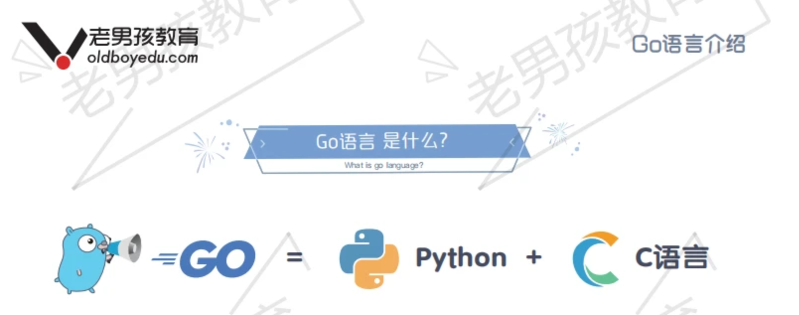

# go 语言学习笔记 - 老男孩教学视频


```
Something I hope you know before go into the coding~
First, please watch or star this repo, I'll be more happy if you follow me.
Bug report, questions and discussion are welcome, you can post an issue or pull a request.
```

## 相关站点

* GitHub 地址 : <https://github.com/yifengyou/learn-go>
* GibBook 地址 : <https://yifengyou.gitbooks.io/learn-gp/content/>
* GibPage 地址 : <https://yifengyou.github.io/learn-go>

## 目录

* [为什么要学习Go](docs/oldboy/为什么要学习Go.md)
* [课上所有物料介绍](docs/oldboy/课上所有物料介绍.md)


## 图示


