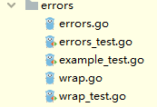

# errors



* errors是包，error是类型
* error本质就是字符串以及围绕字符串的一些列封装拆封操作
* errors包的内容比较少，核心是errors.go，wrap.go。其中wrap.go做了些封装，早期没有这个文件


首先 error 接口类型为，只要实现了Error方法且返回string的类型都是error类型

```
// The error built-in interface type is the conventional interface for
// representing an error condition, with the nil value representing no error.
type error interface {
	Error() string
}

```

基于上述，定义了errorString接口体，且实现了Error方法+返回string
所以，本质上error.New()就是new了一个字符串表示错误，抽象意义

```
// Package errors implements functions to manipulate errors.
package errors

// New returns an error that formats as the given text.
func New(text string) error {
	return &errorString{text}
}

// errorString is a trivial implementation of error.
type errorString struct {
	s string
}

func (e *errorString) Error() string {
	return e.s
}
```

## func New(text string) error


* 返回一个error类型，其实这个error类型就是就是 实现了Error方法接口 的类型

```
// The error built-in interface type is the conventional interface for
// representing an error condition, with the nil value representing no error.
type error interface {
	Error() string
}
```

实例

```
	e := errors.New("abc")
	fmt.Printf("%T\n%#v\n", e, e)
  // *errors.errorString
  // &errors.errorString{s:"abc"}
```

* 每次调用errors.New()函数都会返回一个不同的错误值。因此不能直接拿error类型做比较
* error类型的比较问题，首先error.New()的到的是指针，不管怎样，地址肯定是不等的
* 但是，如果定位到结构体指针内部具体指向的数据类型（例如Error方法返回字符串），那就有肯定相等。要分清哦

```
package main

import (
	"errors"
	"fmt"
)

func main() {
	err1 := errors.New("division by zero")
	err2 := errors.New("division by zero")
	err3 := errors.New("unknown error")

	fmt.Printf("%T == %#v\n", err1, err1)
	// *errors.errorString == &errors.errorString{s:"division by zero"}
	fmt.Printf("%T == %#v\n", err2, err2)
	// 	*errors.errorString == &errors.errorString{s:"division by zero"}
	fmt.Println(err1 == err2) // false
	fmt.Println(err1 == err3) // false

	fmt.Println(err1.Error() == err2.Error()) // true
	fmt.Println(err1.Error() == err3.Error()) // false
}
```


## func Unwrap(err error) error

* 将err剔除一层包装

其中fmt.Errorf("wrapper %w", err)用于包裹一层错误

```
func Errorf(format string, a ...interface{}) error
```


## func Is(err, target error) bool

* 判断err是否是target的后代

## func As(err error, target interface{}) bool

* 将error剔除到错误类型为B类型位置


## 参考

* <https://www.cnblogs.com/just-save/p/13033227.html>

---
