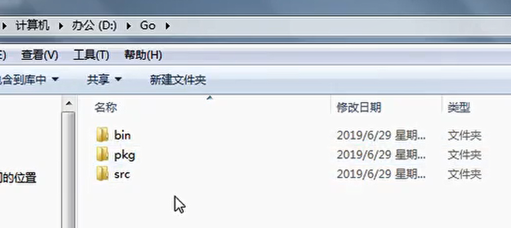
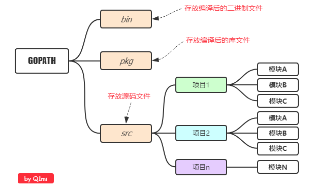
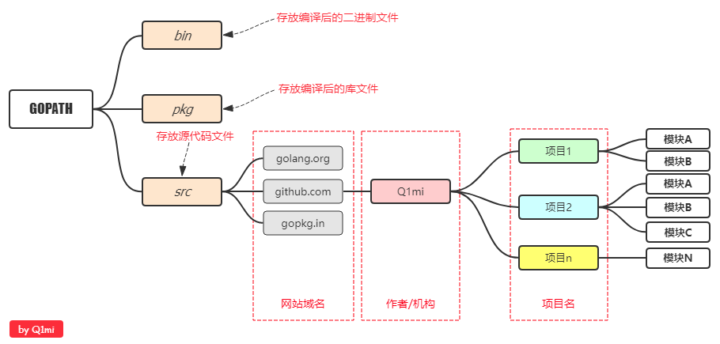
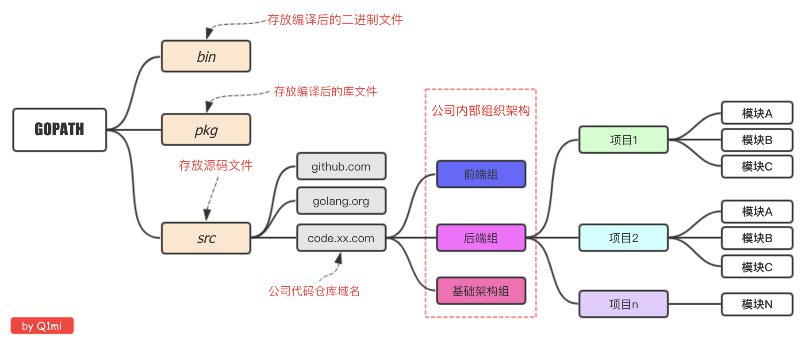

# Go项目目录结构介绍





在进行Go语言开发的时候，我们的代码总是会保存在```$GOPATH/src```目录下。

在工程经过```go build```、```go install```或```go get```等指令后，会将下载的第三方包源代码文件放在```$GOPATH/src```目录下， 产生的二进制可执行文件放在``` $GOPATH/bin```目录下，生成的中间缓存文件会被保存在```$GOPATH/pkg``` 下。

模式一：



模式二：



模式三：


