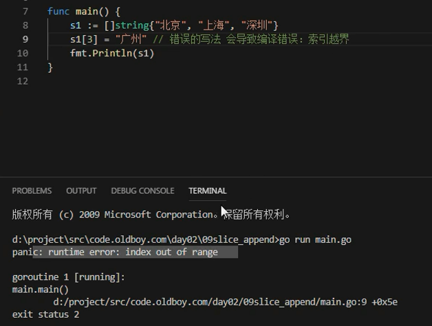
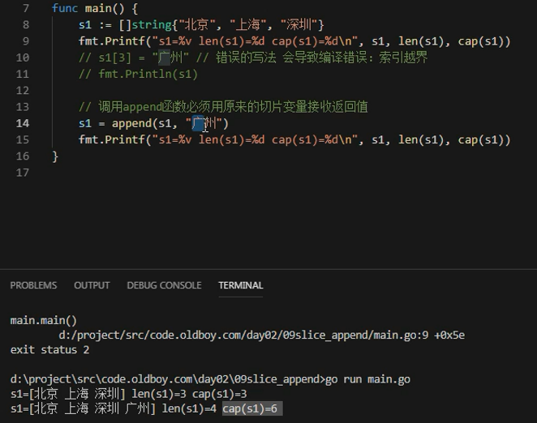
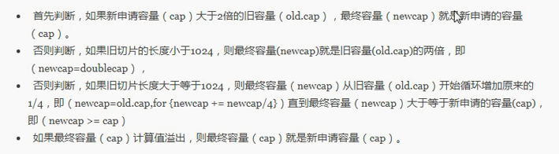
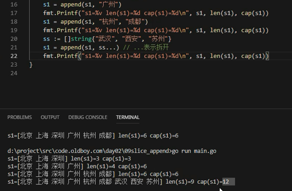

# append和copy

## 切片扩容append

Go语言的内建函数append()可以为切片动态添加元素。 可以一次添加一个元素，可以添加多个元素，也可以添加另一个切片中的元素（后面加…）。
```
func main(){
	var s []int
	s = append(s, 1)        // [1]
	s = append(s, 2, 3, 4)  // [1 2 3 4]
	s2 := []int{5, 6, 7}  
	s = append(s, s2...)    // [1 2 3 4 5 6 7]
}
```
注意：通过var声明的零值切片可以在append()函数直接使用，无需初始化。
```
var s []int
s = append(s, 1, 2, 3)
```
没有必要像下面的代码一样初始化一个切片再传入append()函数使用，
```
s := []int{}  // 没有必要初始化
s = append(s, 1, 2, 3)

var s = make([]int)  // 没有必要初始化
s = append(s, 1, 2, 3)
```
每个切片会指向一个底层数组，这个数组的容量够用就添加新增元素。当底层数组不能容纳新增的元素时，切片就会自动按照一定的策略进行“扩容”，此时该切片指向的底层数组就会更换。“扩容”操作往往发生在append()函数调用时，所以我们通常都需要用原变量接收append函数的返回值。

举个例子：
```
func main() {
	//append()添加元素和切片扩容
	var numSlice []int
	for i := 0; i < 10; i++ {
		numSlice = append(numSlice, i)
		fmt.Printf("%v  len:%d  cap:%d  ptr:%p\n", numSlice, len(numSlice), cap(numSlice), numSlice)
	}
}
```
输出：
```
[0]  len:1  cap:1  ptr:0xc0000a8000
[0 1]  len:2  cap:2  ptr:0xc0000a8040
[0 1 2]  len:3  cap:4  ptr:0xc0000b2020
[0 1 2 3]  len:4  cap:4  ptr:0xc0000b2020
[0 1 2 3 4]  len:5  cap:8  ptr:0xc0000b6000
[0 1 2 3 4 5]  len:6  cap:8  ptr:0xc0000b6000
[0 1 2 3 4 5 6]  len:7  cap:8  ptr:0xc0000b6000
[0 1 2 3 4 5 6 7]  len:8  cap:8  ptr:0xc0000b6000
[0 1 2 3 4 5 6 7 8]  len:9  cap:16  ptr:0xc0000b8000
[0 1 2 3 4 5 6 7 8 9]  len:10  cap:16  ptr:0xc0000b8000
```
从上面的结果可以看出：

* append()函数将元素追加到切片的最后并返回该切片。
* 切片numSlice的容量按照1，2，4，8，16这样的规则自动进行扩容，每次扩容后都是扩容前的2倍。

append()函数还支持一次性追加多个元素。 例如：

```
var citySlice []string
// 追加一个元素
citySlice = append(citySlice, "北京")
// 追加多个元素
citySlice = append(citySlice, "上海", "广州", "深圳")
// 追加切片
a := []string{"成都", "重庆"}
citySlice = append(citySlice, a...)
fmt.Println(citySlice) //[北京 上海 广州 深圳 成都 重庆]
```

## 切片越界



* 检查数组/切片，是否发生越界
* append必须要左值接收



## go扩容策略

* 一般都是扩容两倍，最开始go设计就是两倍扩容
* 后来版本迭代，采取的策略也变化，分配的多了浪费，分配少了频繁分配，需要折中






---
