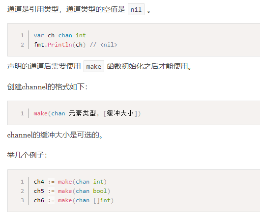
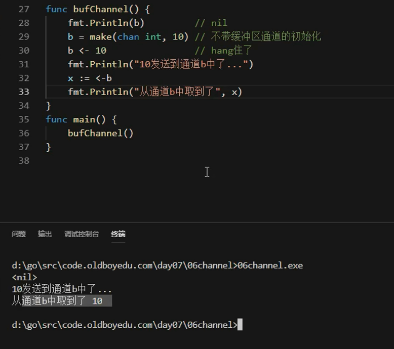

# channel初识

## goroutine是Go程序并发的执行体，channel就是它们之间的连接

* 通过通信共享内存，而不是通过共享内存通信

单纯地将函数并发执行是没有意义的。函数与函数间需要交换数据才能体现并发执行函数的意义。

虽然可以使用共享内存进行数据交换，但是共享内存在不同的goroutine中容易发生竞态问题。为了保证数据交换的正确性，必须使用互斥量对内存进行加锁，这种做法势必造成性能问题。

Go语言的并发模型是CSP（Communicating Sequential Processes），提倡通过**通信共享内存而不是通过共享内存而实现通信。**

如果说goroutine是Go程序并发的执行体，channel就是它们之间的连接。channel是可以让一个goroutine发送特定值到另一个goroutine的通信机制。

Go 语言中的通道（channel）是一种特殊的类型。通道像一个传送带或者队列，总是遵循先入先出（First In First Out）的规则，保证收发数据的顺序。每一个通道都是一个具体类型的导管，也就是声明channel的时候需要为其指定元素类型。

## channel通道类型

* 通道必须初始化才能使用
* 必须使用make函数初始化，slice、map、chan

## 创建channel

## 通道的发送接收关闭

## 无缓冲区通道和有缓冲区通道

* 无缓冲如果没有接收者会炸
* 有缓冲反正在缓冲里，没有接收也没事

* 没有WaitGroup，很快就结束了

* 存多了会卡死

## 通道练习

* 多个消费者，关闭通道只执行一次，多次关闭会panic

* for range默认遇到空也会退出

## 单向通道

有的时候我们会将通道作为参数在多个任务函数间传递，很多时候我们在不同的任务函数中使用通道都会对其进行限制，比如限制通道在函数中只能发送或只能接收。

Go语言中提供了单向通道来处理这种情况

* 确保暴露出去的通道只能有一个作用

## 通道操作总结

 

---
