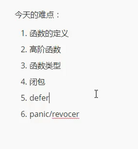

# fmt标准库介绍


* 不知道什么类型用 %v 万能类型


* %a.b : a是显示长度，b是值取长度。两者取最大

## 获取用户输入


### fmt.Scanln

函数签名如下：

```
func Scanln(a ...interface{}) (n int, err error)
```

Scanln类似Scan，它在遇到换行时才停止扫描。最后一个数据后面必须有换行或者到达结束位置。

本函数返回成功扫描的数据个数和遇到的任何错误。


 


---
