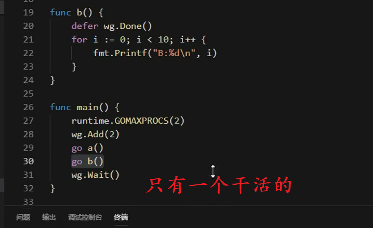
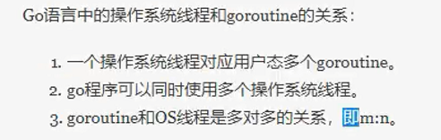

# goroutine调度模型GMP

## goroutine与线程区别

* goroutine 是用户态线程
* 区别于内核态线程

OS线程（操作系统线程）一般都有固定的栈内存（通常为2MB）,一个goroutine的栈在其生命周期开始时只有很小的栈（典型情况下2KB），goroutine的栈不是固定的，他可以按需增大和缩小，goroutine的栈大小限制可以达到1GB，虽然极少会用到这么大。所以在Go语言中一次创建十万左右的goroutine也是可以的。

GPM是Go语言运行时（runtime）层面的实现，是go语言自己实现的一套调度系统。区别于操作系统调度OS线程。

* G很好理解，就是个goroutine的，里面除了存放本goroutine信息外 还有与所在P的绑定等信息。
* P管理着一组goroutine队列，P里面会存储当前goroutine运行的上下文环境（函数指针，堆栈地址及地址边界），P会对自己管理的goroutine队列做一些调度（比如把占用CPU时间较长的goroutine暂停、运行后续的goroutine等等）当自己的队列消费完了就去全局队列里取，如果全局队列里也消费完了会去其他P的队列里抢任务。
* M（machine）是Go运行时（runtime）对操作系统内核线程的虚拟， M与内核线程一般是一一映射的关系， 一个groutine最终是要放到M上执行的；

P(Processor)是一个抽象的概念，并不是真正的物理CPU。所以当P有任务时需要创建或者唤醒一个系统线程来执行它队列里的任务。所以P/M需要进行绑定，构成一个执行单元。
P决定了同时可以并发任务的数量，可通过GOMAXPROCS限制同时执行用户级任务的操作系统线程。可以通过runtime.GOMAXPROCS进行指定。在Go1.5之后GOMAXPROCS被默认设置可用的核数，而之前则默认为1。

M是一个线程或称为Machine，所有M是有线程栈的。如果不对该线程栈提供内存的话，系统会给该线程栈提供内存(不同操作系统提供的线程栈大小不同)。当指定了线程栈，则M.stack→G.stack，M的PC寄存器指向G提供的函数，然后去执行。

G是Goroutine的缩写，相当于操作系统中的进程控制块，在这里就是Goroutine的控制结构，是对Goroutine的抽象。其中包括执行的函数指令及参数；G保存的任务对象；线程上下文切换，现场保护和现场恢复需要的寄存器(SP、IP)等信息。

Go不同版本Goroutine默认栈大小不同。

* P与M一般也是一一对应的。他们关系是： P管理着一组G挂载在M上运行。当一个G长久阻塞在一个M上时，runtime会新建一个M，阻塞G所在的P会把其他的G 挂载在新建的M上。当旧的G阻塞完成或者认为其已经死掉时 回收旧的M。
* P的个数是通过runtime.GOMAXPROCS设定（最大256），Go1.5版本之后默认为物理线程数。 在并发量大的时候会增加一些P和M，但不会太多，切换太频繁的话得不偿失。

## GOMAXPROCESS设定

runtime.GOMAXPROCESS(n)

* n=0 获取当前值
* n=* 设置值

* 有两个任务但是只有一个干活的，那么就会先a后b或者先b后a

---
