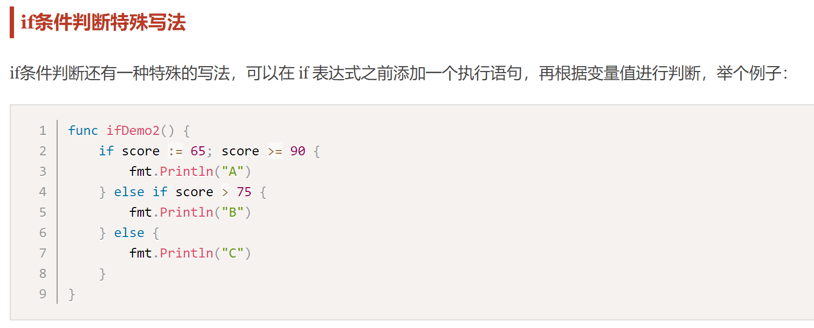
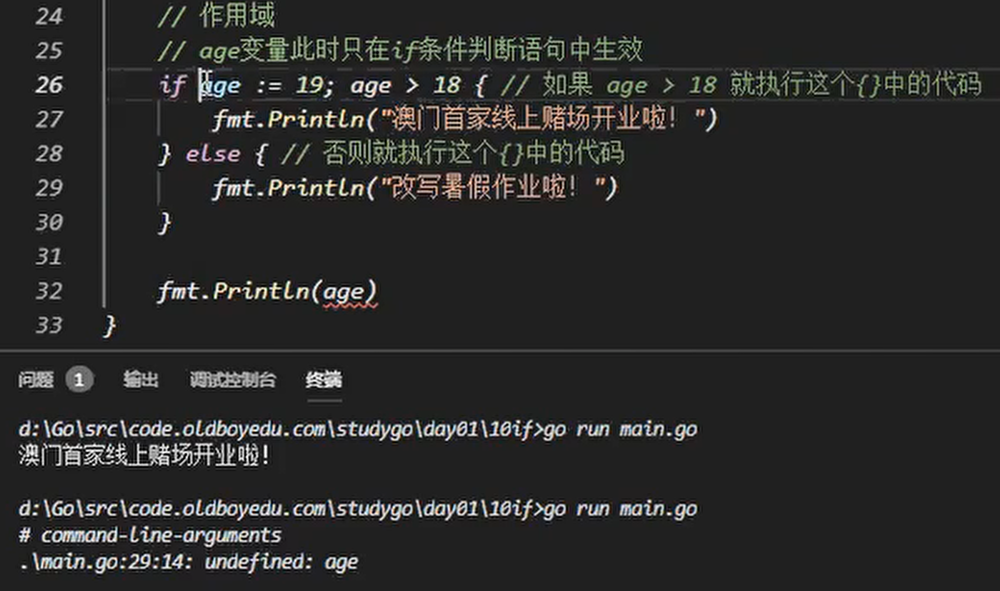

# if判断和for循环

## if else(分支结构)

Go语言中最常用的流程控制有if和for，而switch和goto主要是为了简化代码、降低重复代码而生的结构，属于扩展类的流程控制。

* 因为go的for去掉分号，等价于C的while
* go中没有while

if else(分支结构)
if条件判断基本写法
Go语言中if条件判断的格式如下：
```
if 表达式1 {
    分支1
} else if 表达式2 {
    分支2
} else{
    分支3
}
```
当表达式1的结果为true时，执行分支1，否则判断表达式2，如果满足则执行分支2，都不满足时，则执行分支3。 if判断中的else if和else都是可选的，可以根据实际需要进行选择。

Go语言规定与if匹配的左括号{必须与if和表达式放在同一行，{放在其他位置会触发编译错误。 同理，与else匹配的{也必须与else写在同一行，else也必须与上一个if或else if右边的大括号在同一行。

举个例子：
```
func ifDemo1() {
	score := 65
	if score >= 90 {
		fmt.Println("A")
	} else if score > 75 {
		fmt.Println("B")
	} else {
		fmt.Println("C")
	}
}
```



* 特殊写法：限定局部变量作用域



## for(循环结构)

Go 语言中的所有循环类型均可以使用for关键字来完成。

for循环的基本格式如下：
```
for 初始语句;条件表达式;结束语句{
    循环体语句
}
```
条件表达式返回true时循环体不停地进行循环，直到条件表达式返回false时自动退出循环。
```
func forDemo() {
	for i := 0; i < 10; i++ {
		fmt.Println(i)
	}
}
```
for循环的初始语句可以被忽略，但是初始语句后的分号必须要写，例如：
```
func forDemo2() {
	i := 0
	for ; i < 10; i++ {
		fmt.Println(i)
	}
}
```
for循环的初始语句和结束语句都可以省略，相当于while，例如：
```
func forDemo3() {
	i := 0
	for i < 10 {
		fmt.Println(i)
		i++
	}
}
```
这种写法类似于其他编程语言中的while，在while后添加一个条件表达式，满足条件表达式时持续循环，否则结束循环。

无限循环
```
for {
    循环体语句
}
```
for循环可以通过break、goto、return、panic语句强制退出循环。


## for range(键值循环)

Go语言中可以使用for range遍历数组、切片、字符串、map 及通道（channel）。 通过for range遍历的返回值有以下规律：

* 数组、切片、字符串返回索引和值。
* map返回键和值。
* 通道（channel）只返回通道内的值。


---
