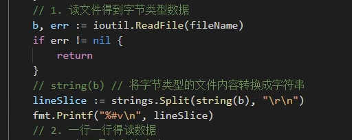

# ini配置文件解析

## init配置结构

* 节 [] 开头 为 节，小节
* 键值对属于某个小节
* # 开头是注释
* ；开头是注释

* 配置到对象，典型的反序列化的过程

## 反序列化配置

* 如果传参不是指针

## 读文件

* 使用ioutil一次性全都读取出来，关闭文件。然后再解析
* 读取出string类型，然后split分割

## 一行一行判断

* 如果是#、;开头，就是注释，需要跳过
* 去掉字符串的首尾空格 strings.TrimSpace()

---
