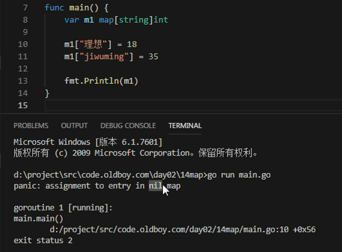

# map



* map属于引用类型，一定要初始化后才能使用。初始化就是在内存中开辟空间，new一下，make一下


* 如果取一个不存在的键呢？使用ok接收，如果ok，如果不ok


Go语言中提供的映射关系容器为map，其内部使用散列表（hash）实现。

* map是一种无序的基于key-value的数据结构，Go语言中的map是引用类型，必须初始化才能使用。

## map定义

Go语言中 map的定义语法如下：
```
map[KeyType]ValueType
```
其中，

* KeyType:表示键的类型。
* ValueType:表示键对应的值的类型。
* map类型的变量默认初始值为nil，需要使用make()函数来分配内存。语法为：
*
```
make(map[KeyType]ValueType, [cap])
```

其中cap表示map的容量，该参数虽然不是必须的，但是我们应该在初始化map的时候就为其指定一个合适的容量。

## map基本使用

map中的数据都是成对出现的，map的基本使用示例代码如下：

```
func main() {
	scoreMap := make(map[string]int, 8)
	scoreMap["张三"] = 90
	scoreMap["小明"] = 100
	fmt.Println(scoreMap)
	fmt.Println(scoreMap["小明"])
	fmt.Printf("type of a:%T\n", scoreMap)
}
```
输出：
```
map[小明:100 张三:90]
100
type of a:map[string]int
```

map也支持在声明的时候填充元素，例如：
```
func main() {
	userInfo := map[string]string{
		"username": "沙河小王子",
		"password": "123456",
	}
	fmt.Println(userInfo) //
}
```

## 判断某个键是否存在

Go语言中有个判断map中键是否存在的特殊写法，格式如下:
```
value, ok := map[key]
```
举个例子：
```
func main() {
	scoreMap := make(map[string]int)
	scoreMap["张三"] = 90
	scoreMap["小明"] = 100
	// 如果key存在ok为true,v为对应的值；不存在ok为false,v为值类型的零值
	v, ok := scoreMap["张三"]
	if ok {
		fmt.Println(v)
	} else {
		fmt.Println("查无此人")
	}
}
```

## map的遍历

Go语言中使用for range遍历map。
```
func main() {
	scoreMap := make(map[string]int)
	scoreMap["张三"] = 90
	scoreMap["小明"] = 100
	scoreMap["娜扎"] = 60
	for k, v := range scoreMap {
		fmt.Println(k, v)
	}
}
```

但我们只想遍历key的时候，可以按下面的写法：

```
func main() {
	scoreMap := make(map[string]int)
	scoreMap["张三"] = 90
	scoreMap["小明"] = 100
	scoreMap["娜扎"] = 60
	for k := range scoreMap {
		fmt.Println(k)
	}
}
```

注意： 遍历map时的元素顺序与添加键值对的顺序无关。

## 使用delete()函数删除键值对

使用delete()内建函数从map中删除一组键值对，delete()函数的格式如下：
```
delete(map, key)
```
其中，

* map:表示要删除键值对的map
* key:表示要删除的键值对的键
* 如果对应的key不存在，不会报错


* delete 内置函数不能在IDE上直接跳转查看源码


示例代码如下：

```
func main(){
	scoreMap := make(map[string]int)
	scoreMap["张三"] = 90
	scoreMap["小明"] = 100
	scoreMap["娜扎"] = 60
	delete(scoreMap, "小明")//将小明:100从map中删除
	for k,v := range scoreMap{
		fmt.Println(k, v)
	}
}
```

按照指定顺序遍历map

```
func main() {
	rand.Seed(time.Now().UnixNano()) //初始化随机数种子

	var scoreMap = make(map[string]int, 200)

	for i := 0; i < 100; i++ {
		key := fmt.Sprintf("stu%02d", i) //生成stu开头的字符串
		value := rand.Intn(100)          //生成0~99的随机整数
		scoreMap[key] = value
	}
	//取出map中的所有key存入切片keys
	var keys = make([]string, 0, 200)
	for key := range scoreMap {
		keys = append(keys, key)
	}
	//对切片进行排序
	sort.Strings(keys)
	//按照排序后的key遍历map
	for _, key := range keys {
		fmt.Println(key, scoreMap[key])
	}
}
```

## 元素为map类型的切片

下面的代码演示了切片中的元素为map类型时的操作：

```
func main() {
	var mapSlice = make([]map[string]string, 3)
	for index, value := range mapSlice {
		fmt.Printf("index:%d value:%v\n", index, value)
	}
	fmt.Println("after init")
	// 对切片中的map元素进行初始化
	mapSlice[0] = make(map[string]string, 10)
	mapSlice[0]["name"] = "小王子"
	mapSlice[0]["password"] = "123456"
	mapSlice[0]["address"] = "沙河"
	for index, value := range mapSlice {
		fmt.Printf("index:%d value:%v\n", index, value)
	}
}
```

* 索引越界错误


* 切片值为引用类型，对应的引用类型也要初始化


## 值为切片类型的map

下面的代码演示了map中值为切片类型的操作：

```
func main() {
	var sliceMap = make(map[string][]string, 3)
	fmt.Println(sliceMap)
	fmt.Println("after init")
	key := "中国"
	value, ok := sliceMap[key]
	if !ok {
		value = make([]string, 0, 2)
	}
	value = append(value, "北京", "上海")
	sliceMap[key] = value
	fmt.Println(sliceMap)
}
```

 

观察下面代码，写出最终的打印结果
```
func main() {
	type Map map[string][]int
	m := make(Map)
	s := []int{1, 2}
	s = append(s, 3)
	fmt.Printf("%+v\n", s)
	m["q1mi"] = s
	s = append(s[:1], s[2:]...)
	fmt.Printf("%+v\n", s)
	fmt.Printf("%+v\n", m["q1mi"])
}
```


---
