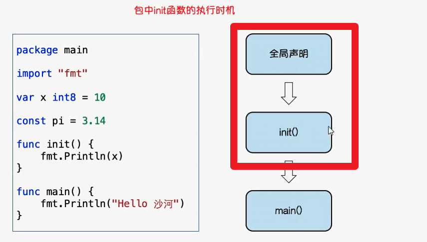

# package相关

* 首字母大小写关系很大

* 默认按文件夹名字导入
* 可以开头起一个别名
* import必须写路径，不支持写go文件
* 默认一个目录就是同一个包，强制！

* 合法标识符，字母和下划线

## 匿名导入包

* 不用提供的方法，用来干嘛？
* 仅用到init函数

## init()初始化函数

* init没有参数也没有返回值
* 不能手动调用，只能自动调用

 

---
