# struct结构体


* Go语言中的基础数据类型可以表示一些事物的基本属性，但是当我们想表达一个事物的全部或部分属性时，这时候再用单一的基本数据类型明显就无法满足需求了，Go语言提供了一种自定义数据类型，可以封装多个基本数据类型，这种数据类型叫结构体，英文名称struct。 也就是我们可以通过struct来定义自己的类型了。

* Go语言中通过struct来实现面向对象。

使用type和struct关键字来定义结构体，具体代码格式如下：

```
type 类型名 struct {
    字段名 字段类型
    字段名 字段类型
    …
}
```

其中：

* 类型名：标识自定义结构体的名称，在同一个包内不能重复。
* 字段名：表示结构体字段名。结构体中的字段名必须唯一。
* 字段类型：表示结构体字段的具体类型。

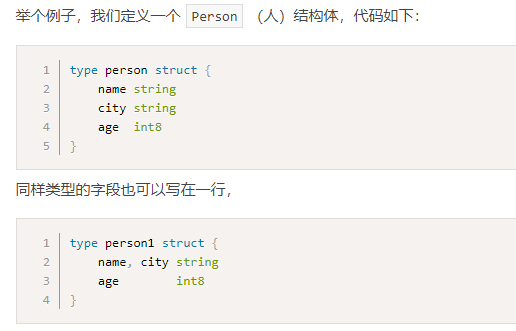

* 为什么不用map？

* 结构体是值类型，默认初始化为0值


* 匿名结构体

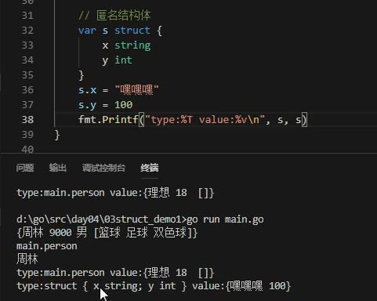

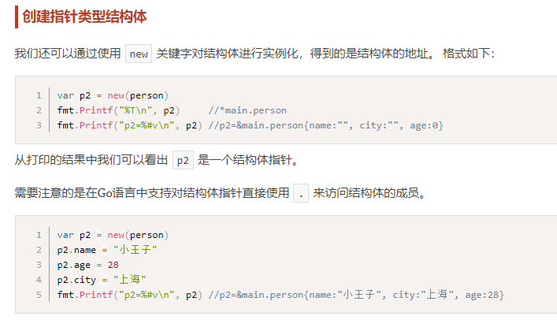


## 结构体是值类型不是引用类型

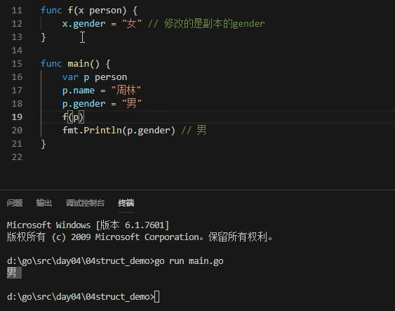

* 函数传参，副本传递

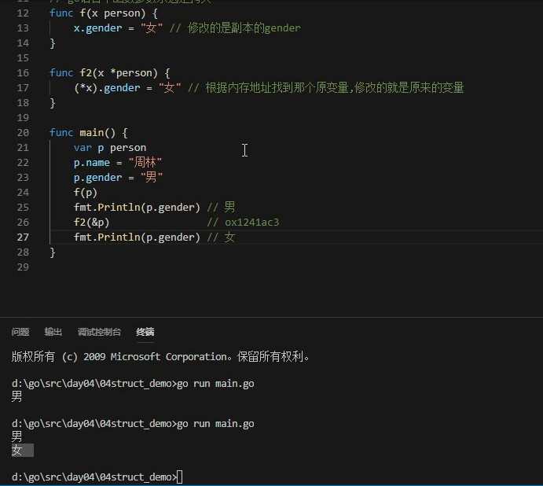


* go中函数传参永远都是值拷贝

## go中针对指针的语法糖

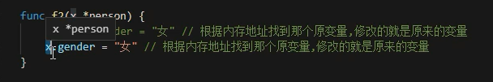

* (*p).age 等价于 p.age
* go语法自动识别

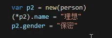

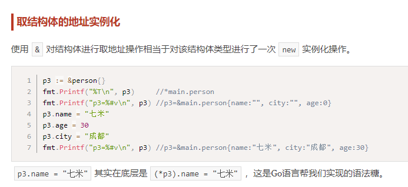

## struct和new的关系

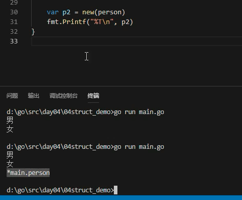

* new返回类型指针


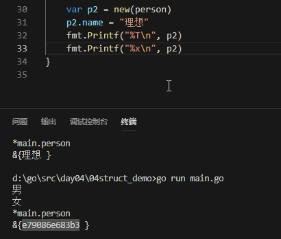

## 指针地址获取

* %p不会强转哦，编写者自己要清楚给的是地址还是值
*

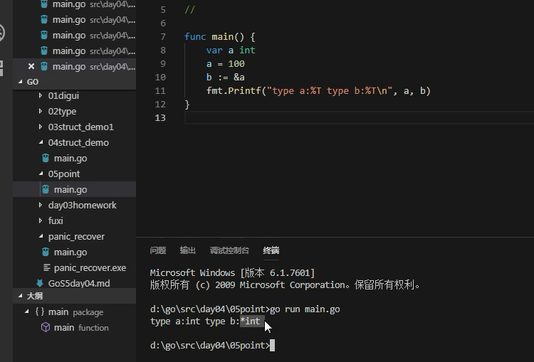

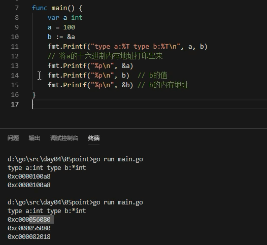

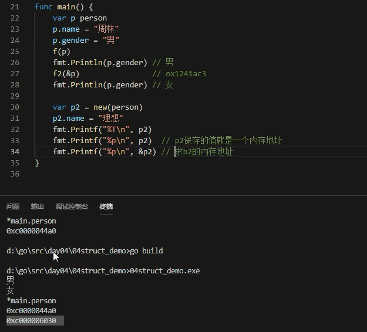

## 结构体初始化

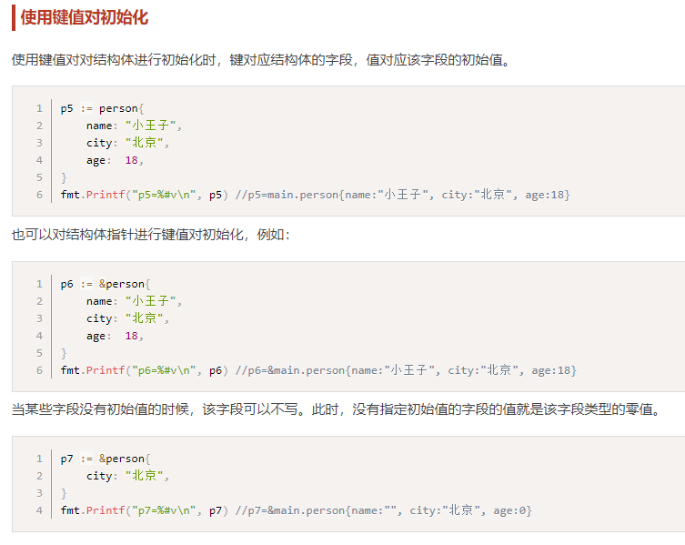

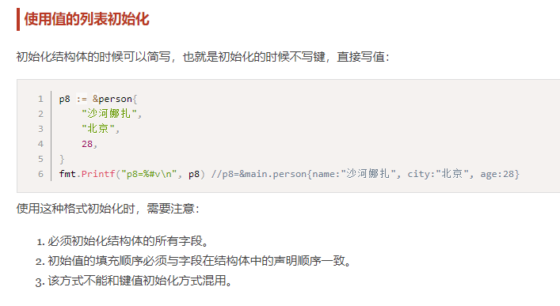

* 不能混用

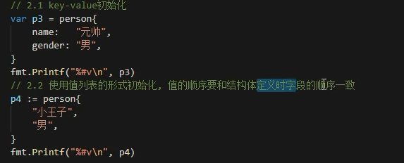

* 结构体在内存中是连续的一块内存

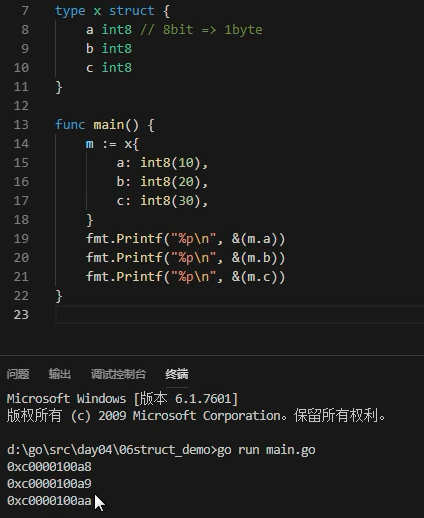

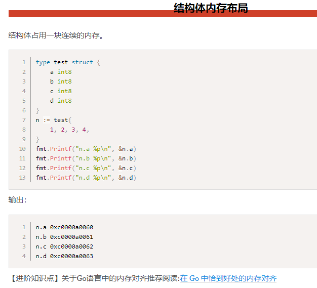

## 空结构体

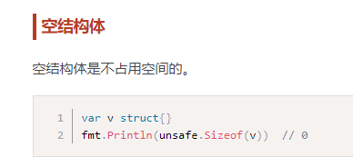

* 空结构体有什么实际意义？


---
