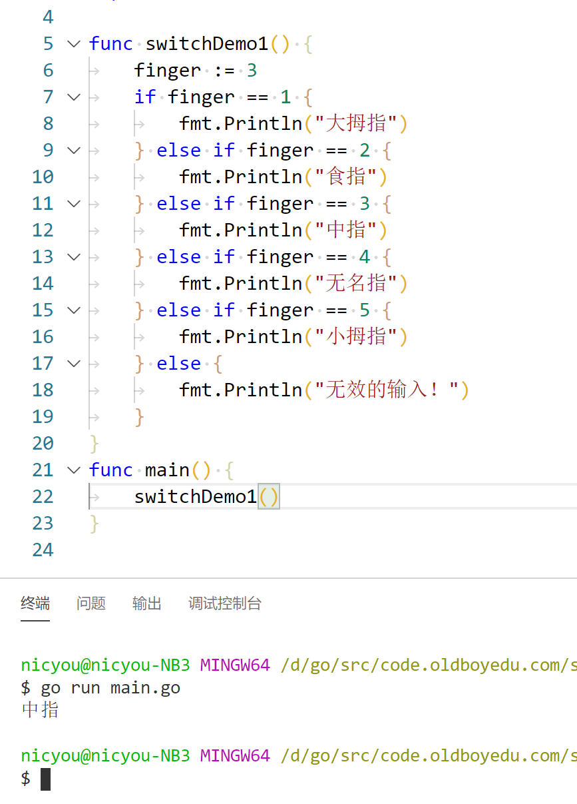
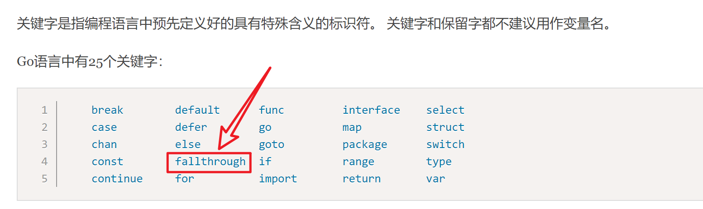

# switch和goto

## break跳出循环

* break只能跳出一层循环
* break语句可以结束for、switch和select的代码块。

break语句还可以在语句后面添加标签，表示退出某个标签对应的代码块，标签要求必须定义在对应的for、switch和 select的代码块上。 举个例子：

```
func breakDemo1() {
BREAKDEMO1:
	for i := 0; i < 10; i++ {
		for j := 0; j < 10; j++ {
			if j == 2 {
				break BREAKDEMO1
			}
			fmt.Printf("%v-%v\n", i, j)
		}
	}
	fmt.Println("...")
}
```


## continue跳出当前循环

* continue只能跳过当前循环后续执行，下一次循环依然会进行
* continue语句可以结束当前循环，开始下一次的循环迭代过程，仅限在for循环内使用。
* 在 continue语句后添加标签时，表示开始标签对应的循环

```
func continueDemo() {
forloop1:
	for i := 0; i < 5; i++ {
		// forloop2:
		for j := 0; j < 5; j++ {
			if i == 2 && j == 2 {
				continue forloop1
			}
			fmt.Printf("%v-%v\n", i, j)
		}
	}
}
```

## switch大量条件判断

```
switch 变量 {
  case X：
  ....
  case Y：
  ....
  case Z：
  ....
  default：
  ....
}
```

使用switch语句可方便地对大量的值进行条件判断。
```
func switchDemo1() {
	finger := 3
	switch finger {
	case 1:
		fmt.Println("大拇指")
	case 2:
		fmt.Println("食指")
	case 3:
		fmt.Println("中指")
	case 4:
		fmt.Println("无名指")
	case 5:
		fmt.Println("小拇指")
	default:
		fmt.Println("无效的输入！")
	}
}
```

相当于

```
func switchDemo1() {
	finger := 3
	if finger == 1 {
		fmt.Println("大拇指")
	} else if finger == 2 {
		fmt.Println("食指")
	} else if finger == 3 {
		fmt.Println("中指")
	} else if finger == 4 {
		fmt.Println("无名指")
	} else if finger == 5 {
		fmt.Println("小拇指")
	} else {
		fmt.Println("无效的输入！")
	}
}
```



* Go语言规定每个switch只能有一个default分支。
* 一个分支可以有多个值，多个case值中间使用英文逗号分隔。
* case其实就是```else if 变量==值```

```
func testSwitch3() {
	switch n := 7; n {
	case 1, 3, 5, 7, 9:
		fmt.Println("奇数")
	case 2, 4, 6, 8:
		fmt.Println("偶数")
	default:
		fmt.Println(n)
	}
}
```

* 此时n的作用范围局限在switch语句中
* 分支还可以使用表达式，这时候switch语句后面不需要再跟判断变量。例如：

```
func switchDemo4() {
	age := 30
	switch {
	case age < 25:
		fmt.Println("好好学习吧")
	case age > 25 && age < 35:
		fmt.Println("好好工作吧")
	case age > 60:
		fmt.Println("好好享受吧")
	default:
		fmt.Println("活着真好")
	}
}
```

* ```fallthrough```语法可以执行满足条件的case的下一个case，是为了兼容C语言中的case设计的。
* C语言中，switch默认没有break会执行下一个case语句



* ```fallthrough```是关键字

```
func switchDemo5() {
	s := "a"
	switch {
	case s == "a":
		fmt.Println("a")
		fallthrough
	case s == "b":
		fmt.Println("b")
	case s == "c":
		fmt.Println("c")
	default:
		fmt.Println("...")
	}
}
```
输出：
```
a
b
```

## goto(跳转到指定标签)
goto语句通过标签进行代码间的无条件跳转。goto语句可以在快速跳出循环、避免重复退出上有一定的帮助。Go语言中使用goto语句能简化一些代码的实现过程。 例如双层嵌套的for循环要退出时：
```
func gotoDemo1() {
	var breakFlag bool
	for i := 0; i < 10; i++ {
		for j := 0; j < 10; j++ {
			if j == 2 {
				// 设置退出标签
				breakFlag = true
				break
			}
			fmt.Printf("%v-%v\n", i, j)
		}
		// 外层for循环判断
		if breakFlag {
			break
		}
	}
}
```
使用goto语句能简化代码：
```
func gotoDemo2() {
	for i := 0; i < 10; i++ {
		for j := 0; j < 10; j++ {
			if j == 2 {
				// 设置退出标签
				goto breakTag
			}
			fmt.Printf("%v-%v\n", i, j)
		}
	}
	return
	// 标签
breakTag:
	fmt.Println("结束for循环")
}
```

* 使用goto一次跳过N层循环
* goto跳转必须要处理好善后工作


---
