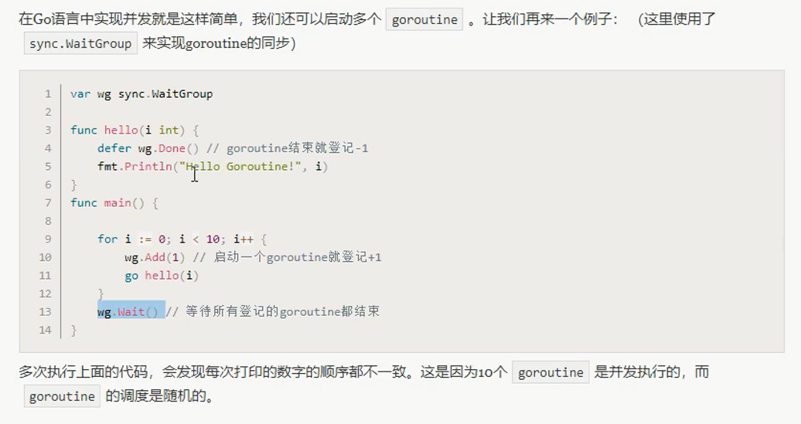

# sync包WaitGroup



* main函数结束，由main创建的所有goroutine都结束

## 如何协调所有goroutine结束后main退出

sync.WaitGroup

1. 定义wg

```
var wg  sync.WaitGroup
```

2. 增加

```
wg.Add()
```

3. 等待

```
wg.Wait()
```

4. 结束

```
wg.Done()  == wg.Add(-1)
```


---
