# time包

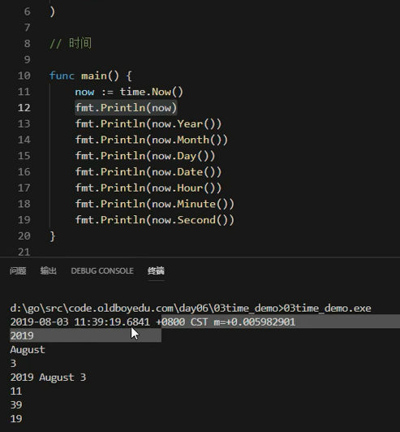

## 时间戳

时间戳是自1970年1月1日（08:00:00GMT）至当前时间的总毫秒数。它也被称为Unix时间戳（UnixTimestamp）。

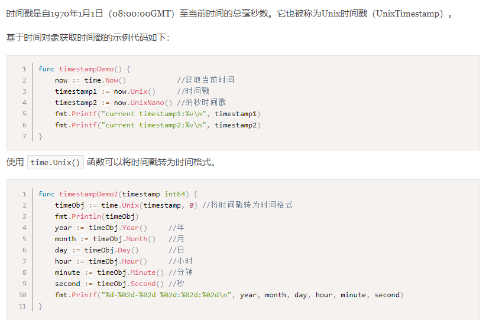

## 时间间隔

time.Duration是time包定义的一个类型，它代表两个时间点之间经过的时间，以纳秒为单位。time.Duration表示一段时间间隔，可表示的最长时间段大约290年。

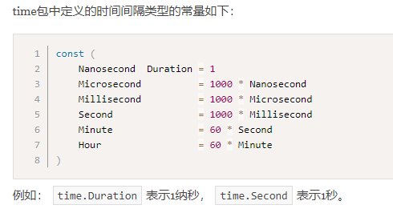

## 时间操作

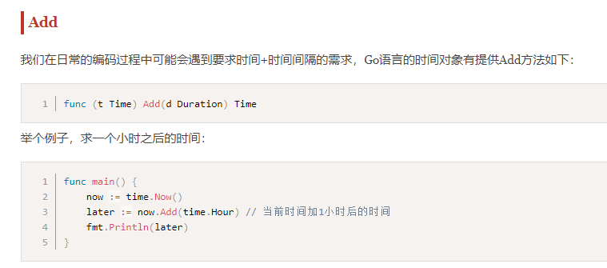

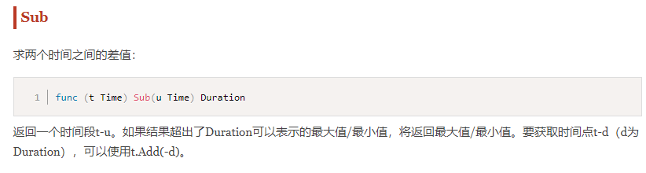

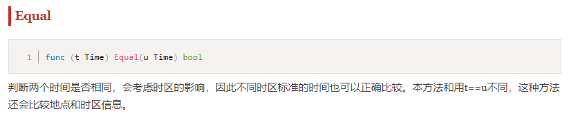

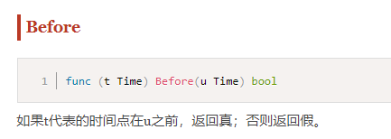

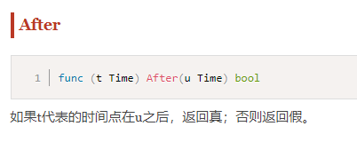

## 定时器

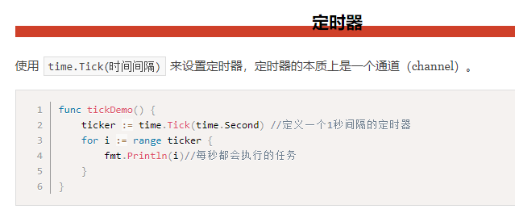

## 时间格式化

* go语言中没有Y m d HMS

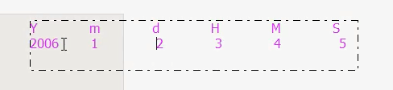

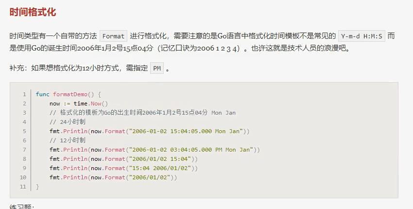

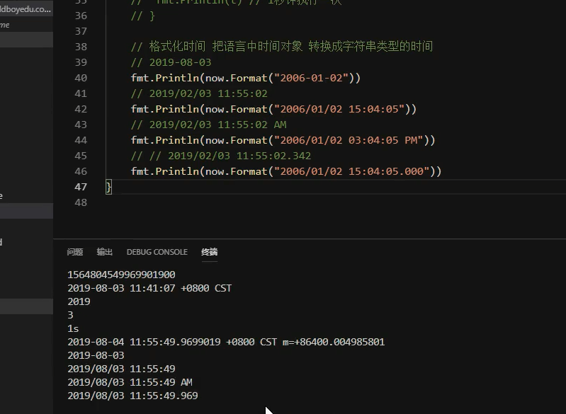

* 感觉比python好用

## 字符串转时间

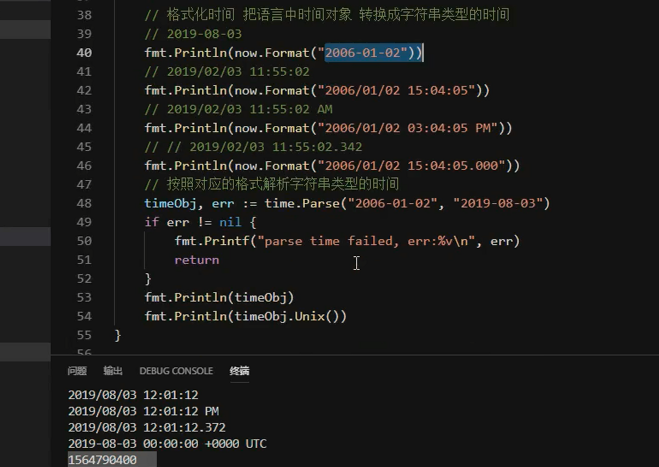 

---
