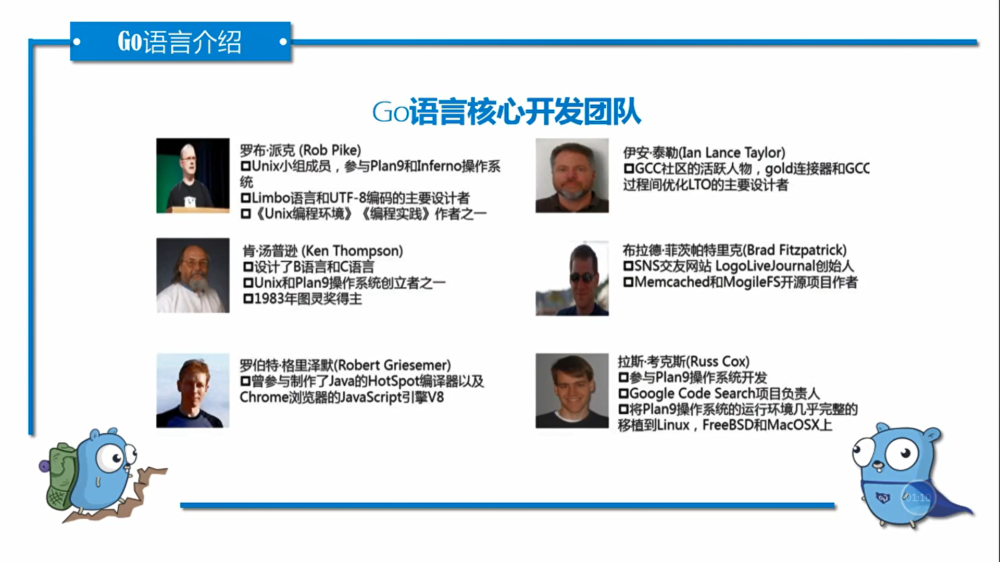
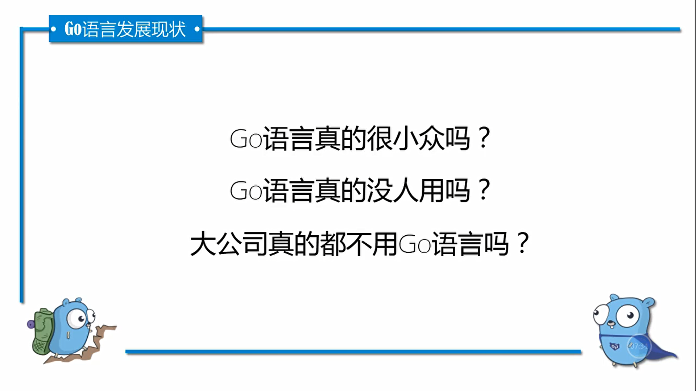

# 为什么要学习Go

## 什么是Go语言


* Google开源，萌芽于Google内部的语言




* 编译型语言和解释型语言区别，执行顺序不同


```
Go = Python + C
```

* 2005年之后才有多核处理器，之前都是单核处理器
* Go语言发布时，应景，考虑到多核CPU执行的需求，默认跑满多核CPU
* Redis是单进程，Redis跑满服务器，方法就是部署多个实例

## Go语言的特点


* 自带格式化，避免花里胡哨写法
* 自带垃圾回收，自带gc，开发效率高一些
* 执行效率，接近于Java，某些特定场景快于Java



## Go语言发展现状


* 知乎服务机房，存量有限，数量太多容纳不下。使用Go重构服务


* 发展特点：**近几年首选语言**
* 新兴的语言，提供给互联网公司新选择

## Go语言发展前景


* 语言层面支持并发

## 课程介绍


## 学习方法


* 一定要多些代码
* 学知识和学技术有什么区别？
  - 知识就是告诉你地球是圆的
  - 游泳基础知识掌握，但是仍然不会游泳
* 编程是技术也是知识，时间就像事业线，挤挤总是有的

---

 3


---
