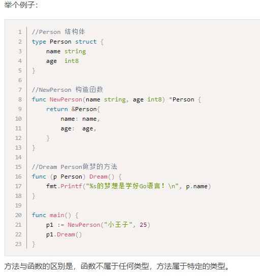
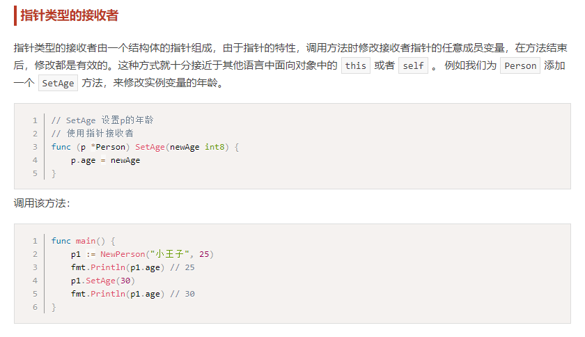
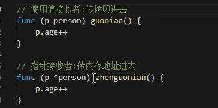
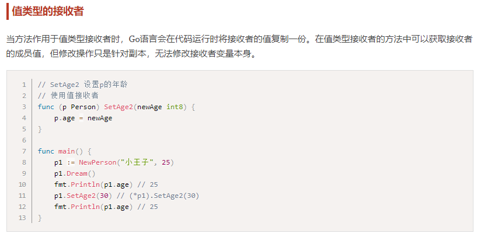
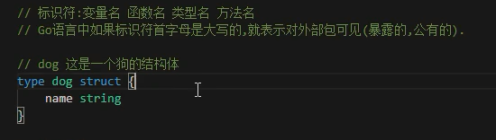
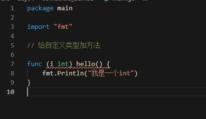
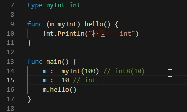

# 值接收者和指针接收者的区别

## 指针类型接收者

## 值类型接收者

什么时候应该使用指针类型接收者
1. 需要修改接收者中的值
2. 接收者是拷贝代价比较大的大对象
3. **保证一致性，如果有某个方法使用了指针接收者，那么其他的方法也应该使用指针接收者**。

## 标识符大写的意义

## 给任意类型添加方法

* 只能给自己定义类型添加
* 其他就要到对应的类型定义中去添加
* **不能给别的包里面类型添加方法**，保证类型及其定义在同一处
* 不同处就重新声明一个新的

---
