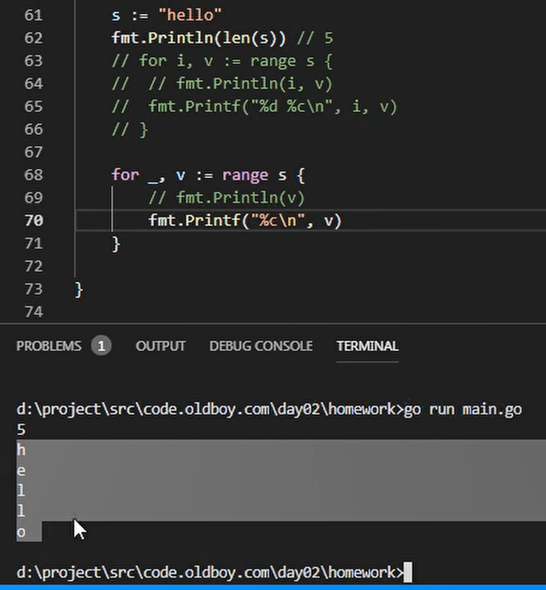

<!-- MDTOC maxdepth:6 firsth1:1 numbering:0 flatten:0 bullets:1 updateOnSave:1 -->

- [内容回顾](#内容回顾)   
   - [GOROOT和GOPATH区别](#goroot和gopath区别)   
   - [go命令](#go命令)   
   - [go语言基础语法](#go语言基础语法)   
   - [变量](#变量)   
   - [常量](#常量)   
   - [流程控制](#流程控制)   
      - [if判断](#if判断)   
      - [for循环](#for循环)   
   - [for中使用range](#for中使用range)   
   - [for循环中使用哑铃变量](#for循环中使用哑铃变量)   
   - [for循环打印乘法口诀表](#for循环打印乘法口诀表)   
   - [fmt打印输出](#fmt打印输出)   
   - [整型](#整型)   
   - [浮点数](#浮点数)   
   - [go中类型不同无法做比较](#go中类型不同无法做比较)   
   - [布尔值](#布尔值)   
   - [字符串](#字符串)   
   - [byte和rune类型](#byte和rune类型)   
   - [字符串、字符、字节都是什么？](#字符串、字符、字节都是什么？)   
   - [二进制、八进制、十六进制](#二进制、八进制、十六进制)   

<!-- /MDTOC -->
# 内容回顾

## GOROOT和GOPATH区别

* GOROOT就是go的安装路径，go.exe所在路径
* GOPATH是作为编译后二进制的存放目的地和import包时的搜索路径 (其实也是你的工作目录, 你可以在src下创建你自己的go源文件, 然后开始工作)。

* 查看go环境变量

```
$ go env
set GO111MODULE=
set GOARCH=amd64
set GOBIN=
set GOCACHE=C:\Users\nicyou\AppData\Local\go-build
set GOENV=C:\Users\nicyou\AppData\Roaming\go\env  
set GOEXE=.exe
set GOFLAGS=
set GOHOSTARCH=amd64
set GOHOSTOS=windows
set GOINSECURE=
set GOMODCACHE=D:\go\pkg\mod
set GONOPROXY=
set GONOSUMDB=
set GOOS=windows
set GOPATH=D:\go
set GOPRIVATE=
set GOPROXY=https://goproxy.cn,direct
set GOROOT=c:\go
set GOSUMDB=sum.golang.org
set GOTMPDIR=
set GOTOOLDIR=c:\go\pkg\tool\windows_amd64
set GCCGO=gccgo
set AR=ar
set CC=gcc
set CXX=g++
set CGO_ENABLED=1
set GOMOD=
set CGO_CFLAGS=-g -O2
set CGO_CPPFLAGS=
set CGO_CXXFLAGS=-g -O2
set CGO_FFLAGS=-g -O2
set CGO_LDFLAGS=-g -O2
set PKG_CONFIG=pkg-config
set GOGCCFLAGS=-m64 -mthreads -fno-caret-diagnostics -Qunused-arguments -fmessage-length=0 -fdebug-prefix-map=C:\Users\nicyou\AppData\Local\Temp\go-build393397774=/tmp/go-build -gno-record-gcc-switches

nicyou@nicyou-NB3 MINGW64 /d/go/src/code.oldboyedu.com/studygo/day01/08string
$
```


```
$ go
Go is a tool for managing Go source code.

Usage:

        go <command> [arguments]

The commands are:

        bug         start a bug report
        build       compile packages and dependencies       
        clean       remove object files and cached files    
        doc         show documentation for package or symbol
        env         print Go environment information        
        fix         update packages to use new APIs
        fmt         gofmt (reformat) package sources
        generate    generate Go files by processing source
        get         add dependencies to current module and install them
        install     compile and install packages and dependencies
        list        list packages or modules
        mod         module maintenance
        run         compile and run Go program
        test        test packages
        tool        run specified go tool
        version     print Go version
        vet         report likely mistakes in packages

Use "go help <command>" for more information about a command.

Additional help topics:

        buildconstraint build constraints
        buildmode       build modes
        c               calling between Go and C
        cache           build and test caching
        environment     environment variables
        filetype        file types
        go.mod          the go.mod file
        gopath          GOPATH environment variable
        gopath-get      legacy GOPATH go get
        goproxy         module proxy protocol
        importpath      import path syntax
        modules         modules, module versions, and more
        module-get      module-aware go get
        module-auth     module authentication using go.sum
        module-private  module configuration for non-public modules
        packages        package lists and patterns
        testflag        testing flags
        testfunc        testing functions

Use "go help <topic>" for more information about that topic.
```

* GOPATH/bin 添加到PATH环境变量，则后续可以直接输入命令。默认会从PATH都说命令
* go install就是安装到GOPATH/bin中

## go命令

* go build：编译go命令
  - -o：指定输出文件名
  - 参数由先后顺序的区别
  - 可以指定目标文件夹路径，不一定必须当前路径，会自动创建目录
* go run：直接运行go文件中的main函数
  - go run不会创建exe
* go install：先编译后拷贝


## go语言基础语法

```
package main
func main() {
  fmt.Println("this is go language")
}
```

* package声明包名
* //单行注释，跟C语言一致
* /**/多行注释，跟C语言一致
* 编译可执行文件，必须是main包的main函数作为入口，因此main包main函数不可或缺
* 函数外面只能写关键字开头的语句


* 函数内部定义的变量必须使用，必须作为左值或右值使用一次


## 变量

* 短变量:=
* 3种声明方式
  - ```var name type``` 变量名在前，类型在后
  - ```var name = ""``` 类型推到，根据赋值类型自动推导
  - 函数专属：短变量 := : ```a:=123```
* 匿名变量_（哑变量）
  - 当有些数据必须用变量接收，但是又不想使用，就用哑变量接收后丢弃

## 常量

* ```const```定义的变量
  - ```const PI=3.1592653```
* iota实现枚举
  - 初始为0，每新增一行累加1
  - 中间手动赋值也会加1

## 流程控制

### if判断

* if
* else
* else if

```
if 条件 {

}
```

```
if 条件 {

} else {

}
```

```
if 条件 {

} else if 条件 {

}
```

```
if 条件 {

} else if 条件 {

} else {

}
```


### for循环

* for = while的使用方式
* 有条件判断和结束语句，则必须有分号隔开
* 如果只有条件判断则不需要两个分号隔开

```
for 初始语句；条件判断：结束语句 {

}
```


* for中只有条件判断，相当于while循环
```
for 条件判断 {

}
```


* i 如果在初始语句，则只能在for中使用
* i 如果在for外，则作用域不限定于for循环


* for无限循环

```
for {

}
```

## for中使用range

* range遍历字符串，自动识别byte类型rune类型


## for循环中使用哑铃变量



## for循环打印乘法口诀表


## fmt打印输出

* Println 打印且自动加换行
* Print 打印不换行
* Printf 格式化打印
* Sprintf 字符串拼接

* %T 输出变量类型

## 整型

* 无符号整型
  - uint8 uint16 uint32 uint64
  - uint 默认是机器OS长度
* 有符号整型
  - int8 int16 int32 uint64
  - int 默认是机器OS长度


## 浮点数

* float32
* float64
* 默认是机器OS字长

## go中类型不同无法做比较


## 布尔值

* 不能和其他类型做转换
* true、false

## 字符串

* 字符串不能直接修改，必须转为rune数组后修改
* 字符串常见操作

## byte和rune类型

* 都属于类型别名
* rune默认是uint


* 使用range的时候，自动转为rune类型


## 字符串、字符、字节都是什么？

* 字符串是双引号包裹
* 字符是单引号
* 字节是存储长度
* 汉字一般是三个字节
* len输出的是字节长度
* len没有默认结束NULL


## 二进制、八进制、十六进制

* %b Printf输出二进制
* go不支持定义二进制
* 八进制0XXXX
* 十六进制0xAAAA
* Println默认是输出十进制，所以如果给的是其他进制默认输出十进制结果


---
