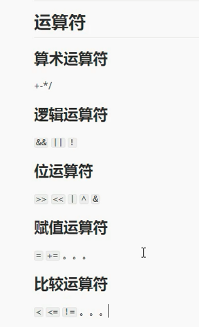
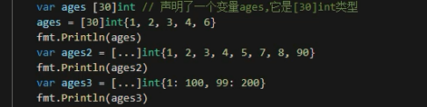
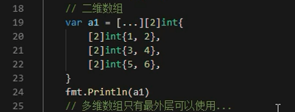
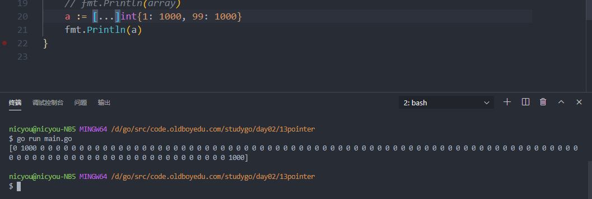
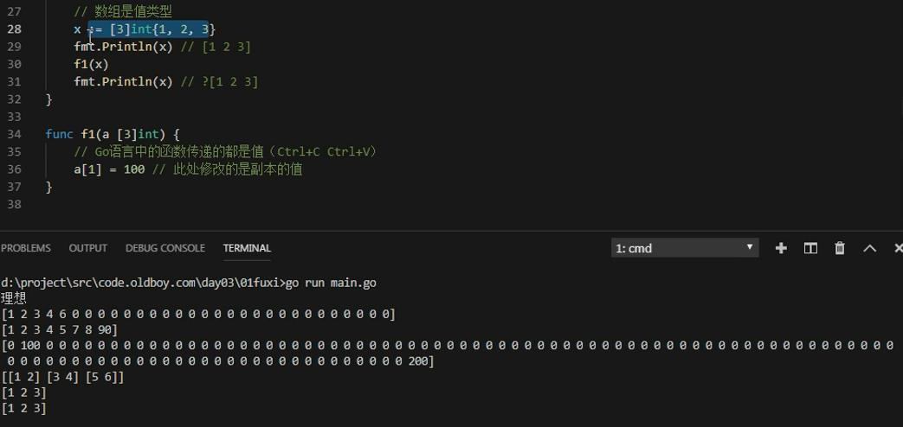
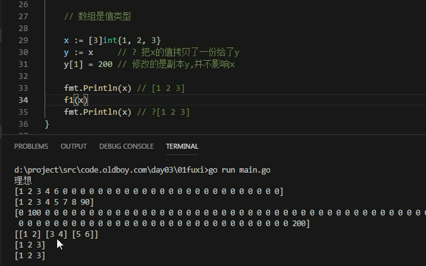

# 内容回顾_运算符和数组




## 数组

```
var args [30]int
var names [400]string
```


* 数据包含元素类型和长度
* 元素类型可以有多种，包括基本类型和复合类型



* 数组，四种初始化方式



* 嵌套数组，使用...





* 数组是值传递，区别于C语言引用传递




## 切片


## 指针


---
