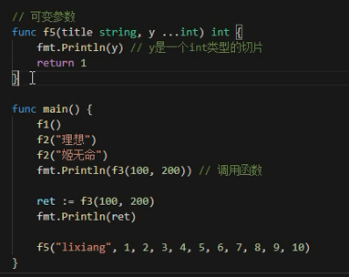
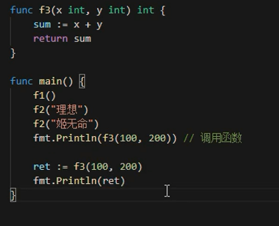
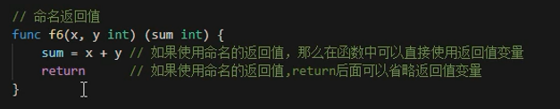
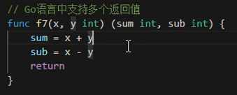
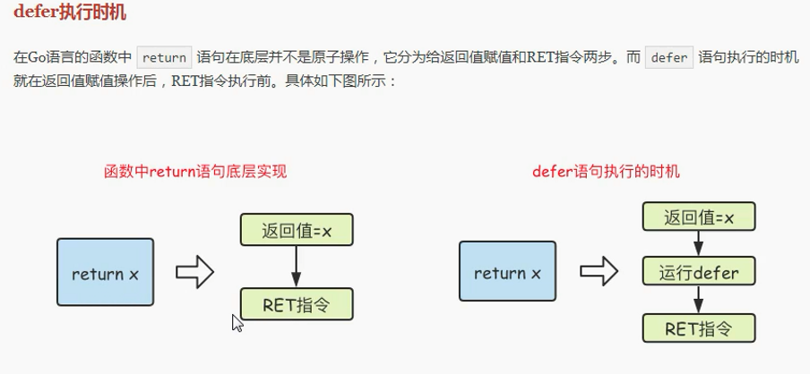
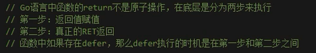
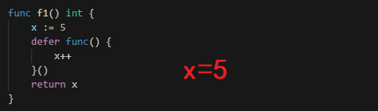
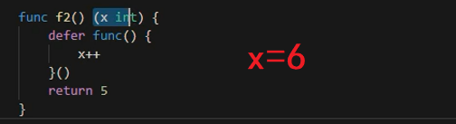
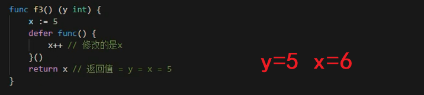
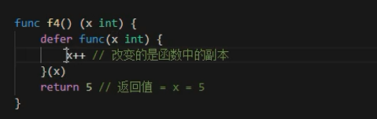

# 函数定义和defer

## 函数

* 所有代码都写到main函数中？代码无法复用
* 函数就是一段代码的封装，减少重写代码次数，简化代码
* 函数本质就是偷懒，减少工作量

```
func gofunc(){

}
```

* go函数可以没有参数，没有返回值

```
func gofunc(a int,b float,q ...int){

}
```



* go支持多参数，本质是放到slice中



* go的返回值可以不处理，但是没有实际意义

```
func gofun(x,y int,z,q float,w,y,z string){

}
```

* 返回值可以命名，也可以不命名





* 支持多返回值


## defer

* defer逆序输出，后进先出





结果判断：









* 参数传参，传的是副本
* 第一步，返回值赋值，第二步defer，第三步返回
* 面试题可以不用，但是不能不会
* 面试题主要靠理论基础是否牢固


---
