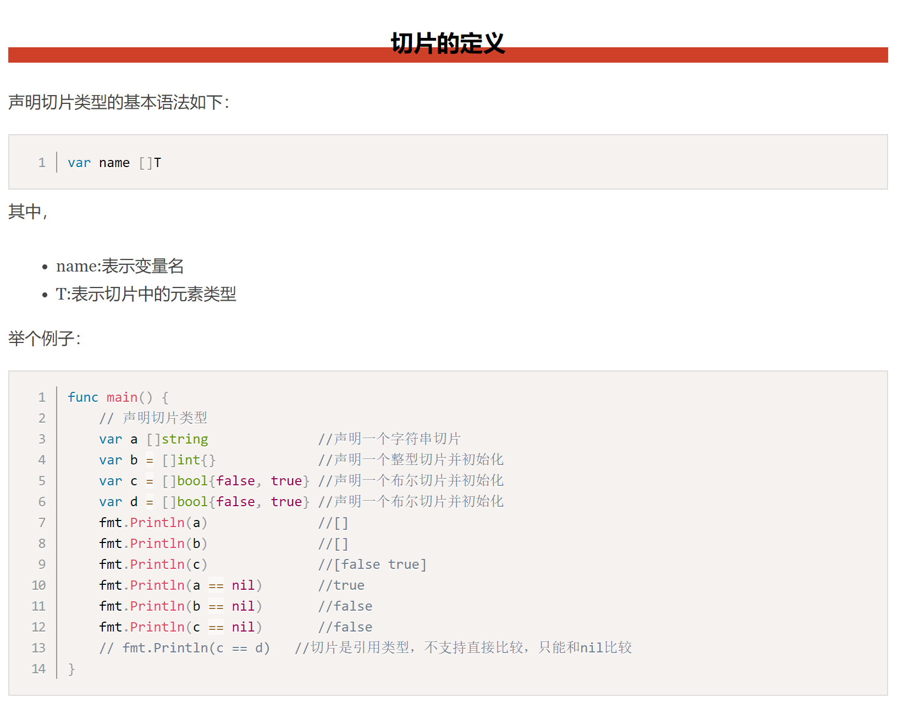

# 切片1

* 切片就是go中python的内容
* 数组长度固定的，声明之后不能改变，是类型的一部分，因此有很多局限性

```
func arraySum(x [3]int) int{
    sum := 0
    for _, v := range x{
        sum = sum + v
    }
    return sum
}
```

这个求和函数只能接受[3]int类型，其他的都不支持。 再比如，

a := [3]int{1, 2, 3}
数组a中已经有三个元素了，我们不能再继续往数组a中添加新元素了。

## 切片

* 切片是引用类型
* 切片（Slice）是一个拥有相同类型元素的可变长度的序列。它是基于数组类型做的一层封装。它非常灵活，支持自动扩容。
* 切片是一个引用类型，它的内部结构包含地址、长度和容量。切片一般用于快速地操作一块数据集合。

## 切片定义

* 只有数组类型，没有数组长度

```
var 切片名字 []类型
```


## 切片初始化

* 切片表达式从字符串、数组、指向数组或切片的指针构造子字符串或切片。它有两种变体：一种指定low和high两个索引界限值的简单的形式，另一种是除了low和high索引界限值外还指定容量的完整的形式。

1. 自定义切片




2. 由已经存在的数组得到切片

```
a1 := [...]int{1,3,7,9,11,13}
s1 := a1[0:4] # 左包含右不包含，左闭右开
s1 := a1[:4]
s1 := a1[4:]
s1 := a1[:]
```

3. 使用make创建切片

我们上面都是基于数组来创建的切片，如果需要动态的创建一个切片，我们就需要使用内置的make()函数，格式如下：
```
make([]T, size, cap)
```
其中：

* T:切片的元素类型
* size:切片中元素的数量
* cap:切片的容量

举个例子：
```
func main() {
	a := make([]int, 2, 10)
	fmt.Println(a)      //[0 0]
	fmt.Println(len(a)) //2
	fmt.Println(cap(a)) //10
}
```
上面代码中a的内部存储空间已经分配了10个，但实际上只用了2个。 容量并不会影响当前元素的个数，所以len(a)返回2，cap(a)则返回该切片的容量。


## 切片的基本使用

1. 修改切片值。切片的修改，实际还是修改了数组


## 切片的长度和容量

* 切片拥有自己的长度和容量，我们可以通过使用内置的len()函数求长度，使用内置的cap()函数求切片的容量。
* **切片容量就是底层数组的容量，是底层数组第一个切片元素开始的到数组结尾的容量**
* 切片的长度就是切片包含的元素个数


* 切片长度 = 切片开始到结尾的个数
* 切片容量 = 切片第一个元素在底层数组中位置到数组结尾的长度


## 切片再切片

* N层切片，基础数组还是那个基础数组
* 切片容量还是要追溯到底层数组

## 切片的本质

* 切片的本质就是对底层数组的封装，它包含了三个信息：底层数组的指针、切片的长度（len）和切片的容量（cap）。
* 用指针引用一段内存

举个例子，现在有一个数组a := [8]int{0, 1, 2, 3, 4, 5, 6, 7}，切片s1 := a[:5]，相应示意图如下。


## 判断切片是否为空

* 要检查切片是否为空，**请始终使用len(s) == 0来判断，而不应该使用s == nil来判断。**


---
