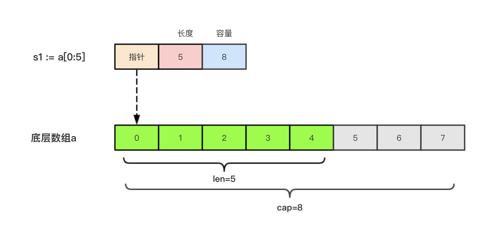

# 切片的本质

* 切片的本质就是对底层数组的封装，它包含了三个信息：底层数组的指针、切片的长度（len）和切片的容量（cap）。
* 用指针引用一段内存，框选一段内存
* 切片长度和容量可以不一致，但是访问超过长度还是会越界

举个例子，现在有一个数组a := [8]int{0, 1, 2, 3, 4, 5, 6, 7}，切片s1 := a[:5]，相应示意图如下。




## 判断切片是否为空

* 要检查切片是否为空，**请始终使用len(s) == 0来判断，而不应该使用s == nil来判断。**

## 切片不能直接比较

1. 切片之间是不能比较的，我们不能使用==操作符来判断两个切片是否含有全部相等元素。
2. 切片唯一合法的比较操作是和nil比较。
3. 一个nil值的切片并没有底层数组，一个nil值的切片的长度和容量都是0。但是我们不能说一个长度和容量都是0的切片一定是nil，例如下面的示例：

```
var s1 []int         //len(s1)=0;cap(s1)=0;s1==nil
s2 := []int{}        //len(s2)=0;cap(s2)=0;s2!=nil
s3 := make([]int, 0) //len(s3)=0;cap(s3)=0;s3!=nil
```

所以要判断一个切片是否是空的，要是用len(s) == 0来判断，不应该使用s == nil来判断。

## 切片的赋值拷贝

* 下面的代码中演示了拷贝前后两个变量共享底层数组，对一个切片的修改会影响另一个切片的内容，这点需要特别注意。
* 切片的修改本质是修改底层数组

```
func main() {
	s1 := make([]int, 3) //[0 0 0]
	s2 := s1             //将s1直接赋值给s2，s1和s2共用一个底层数组
	s2[0] = 100
	fmt.Println(s1) //[100 0 0]
	fmt.Println(s2) //[100 0 0]
}
```


## 切片遍历

切片的遍历方式和数组是一致的，支持索引遍历和for range遍历。
```
func main() {
	s := []int{1, 3, 5}

	for i := 0; i < len(s); i++ {
		fmt.Println(i, s[i])
	}

	for index, value := range s {
		fmt.Println(index, value)
	}
}
```


---
