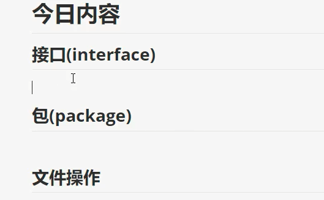
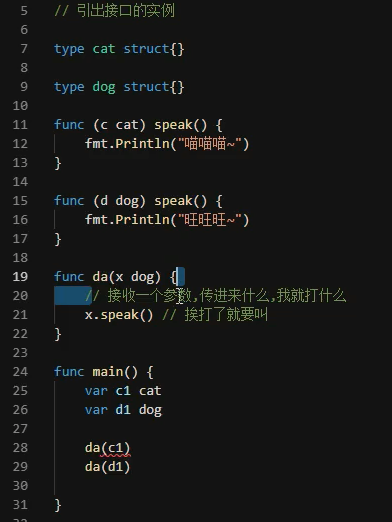
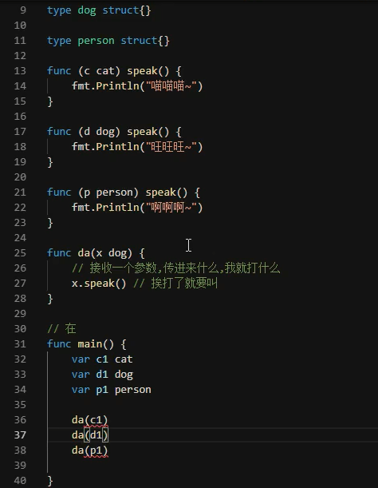
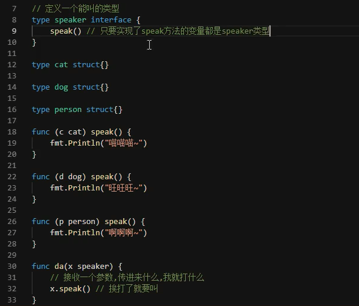
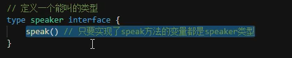
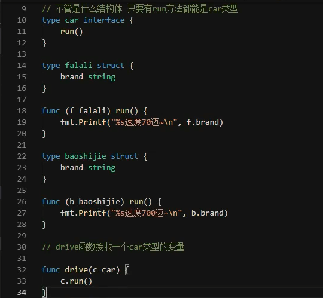

# 初识接口类型

## 今日内容

## 接口

* 新手杀手
* **接口是一种类型**
* 在Go语言中接口（interface）是一种类型，一种抽象的类型。
* interface是一组method的集合，是duck-type programming的一种体现。接口做的事情就像是定义一个协议（规则），只要一台机器有洗衣服和甩干的功能，我就称它为洗衣机。不关心属性（数据），只关心行为（方法）。
* 为了保护你的Go语言职业生涯，请牢记接口（interface）是一种类型。

## 接口的引入

* 编程中，不关心变量是什么类型，只关心能调用它什么方法
* 特殊的类型，不是具体类型，而是约束类型应该有什么方法

* 阿猫阿狗都能在一个函数中调用方法，不关心变量类型，关心变量有什么方法

* 只规定了方法，只要实现了接口里方法的都是该接口的类

* 约束其他类型应该有什么方法
* 自定义类型才是无限量

* 不管你是什么类型，只关心你有什么方法，你只要实现了对应方法就可以了
* 可插拔系统，五花八门的东西总有共同点
* 兼容思想POSIX

---
