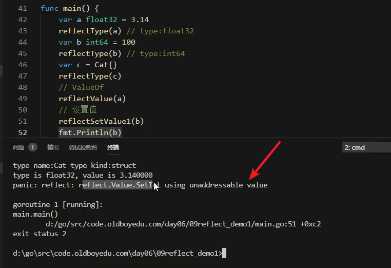
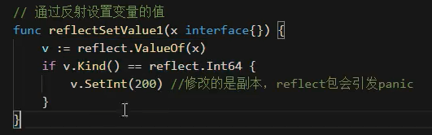
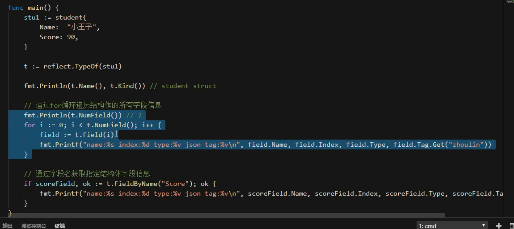

# 反射及附加题作业需求

* 编译就确定的情况比较蝉蛹
* 反射是程序运行期间，对程序变量，对程序自身进行修改

## reflect包

## 获取类型，名字

## 反射改值需要传地址

* 传指针会把类型识别为指针

## 结构体反射（难点）

* 遍历结构体中的所有字段

## 反射性能低下

* 极少使用
* 为了提升兼容性，框架会使用

## init文件解析

## 下期内容

## 回顾

* 时间格式是 2006 01 02 15 04 05 000
* time包，Time类型  
* time.Now()返回时间类型
* 时间戳 1970年1月1日到现在的秒，纳秒数
  - time.Now().UnixNano() 纳秒
  - time.Now().Unix()
* 时间间隔类型time.Duration()

* 时间操作。时间对象相互操作
  - 加法，数值相加
    - time.Add()
  - 减法。s**ub必须是两个时间对象**
    - time.Sub()

* 时间格式化
  - time.Format
* 定时器
  - channal通道，每隔1秒去通道获取
* 根据时间戳解析时间
  - time.Parse(format,str,loc)
  - time.LoadLocation()

* 日志库
  - time
  - 文件操作
  - runtime.Caller()
    - 运行时runtime用于垃圾回收等
  - 结构体，接口，方法，切片，数组，函数

* 反射
  - 让代码更灵活
  - 性能比较差
  - 接口类型变量底层分为两部分，动态类型和动态值
  - json序列化，反序列化

  - 反射的两个方法
    - reflect.TypeOf()
    - reflect.ValueOf()

---
