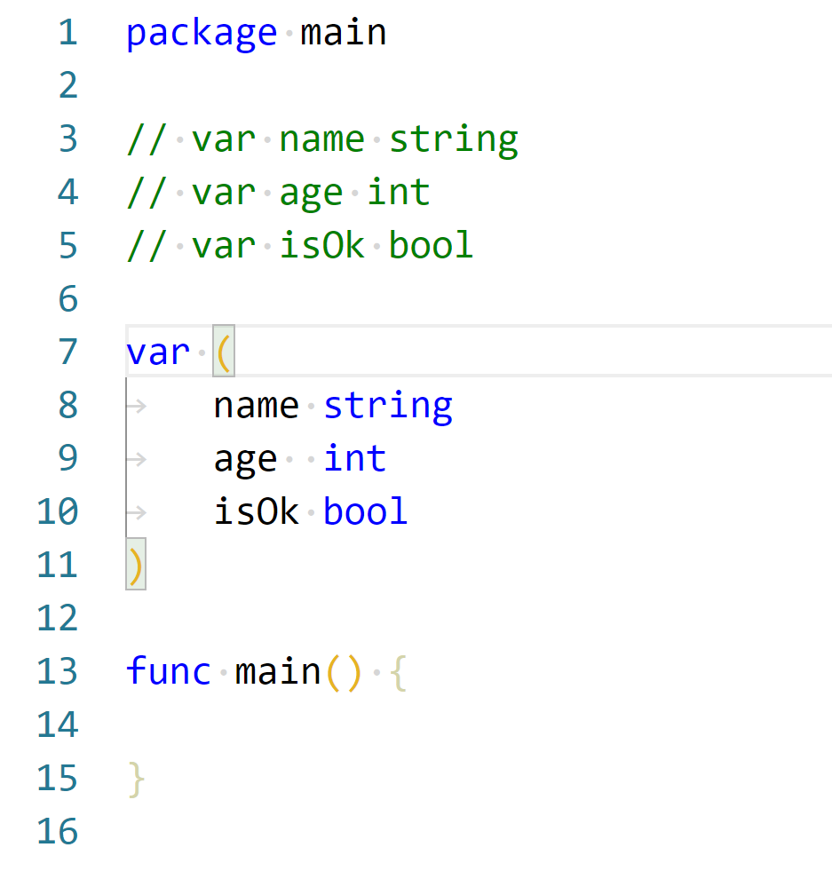

# 变量声明

## 标识符与关键字

### 标识符

在编程语言中标识符就是程序员定义的具有特殊意义的词，比如变量名、常量名、函数名等等。 **Go语言中标识符由字母数字和_(下划线）组成，并且只能以字母和_开头**。 举几个例子：abc, _, _123, a123。

### 关键字

Go语言中有25个关键字：
```
break        default      func         interface    select
case         defer        go           map          struct
chan         else         goto         package      switch
const        fallthrough  if           range        type
continue     for          import       return       var
```
此外，Go语言中还有37个保留字。
```
Constants:    true  false  iota  nil

    Types:    int  int8  int16  int32  int64  
              uint  uint8  uint16  uint32  uint64  uintptr
              float32  float64  complex128  complex64
              bool  byte  rune  string  error

Functions:   make  len  cap  new  append  copy  close  delete
             complex  real  imag
             panic  recover
```

## 变量

### 变量的来历

程序运行过程中的数据都是保存在内存中，我们想要在代码中操作某个数据时就需要去内存上找到这个变量，但是如果我们直接在代码中通过内存地址去操作变量的话，代码的可读性会非常差而且还容易出错，所以我们就**利用变量将这个数据的内存地址保存起来，以后直接通过这个变量就能找到内存上对应的数据了**。

### 变量类型

变量（Variable）的功能是存储数据。不同的变量保存的数据类型可能会不一样。经过半个多世纪的发展，编程语言已经基本形成了一套固定的类型，**常见变量的数据类型有：整型、浮点型、布尔型等。**

Go语言中的每一个变量都有自己的类型，并且变量在局部作用域中必须经过声明才能开始使用。

### 变量声明

* **Go语言中的变量需要声明后才能使用，同一作用域内不支持重复声明。 并且Go语言的变量声明后必须使用。**
* Python不声明可以直接作为左值

### 标准声明

Go语言的变量声明格式为：
```
var 变量名 变量类型
```

* 变量声明以关键字var开头，变量类型放在变量的后面，行尾无需分号。
* 指定类型后类型固定，不能直接修改变量类型，只能重新创建一个变量。

举个例子：

```
var name string
var age int
var isOk bool
```
### 批量声明

每声明一个变量就需要写var关键字会比较繁琐，go语言中还支持批量变量声明：

```
var (
    a string
    b int
    c bool
    d float32
)
```




## 变量的初始化

* Go语言在声明变量的时候，会自动对变量对应的内存区域进行初始化操作。
* 每个变量会被初始化成其类型的默认值，例如： 整型和浮点型变量的默认值为0。
* 字符串变量的默认值为空字符串。 布尔型变量默认为false。
* 切片、函数、指针变量的默认为nil。

当然我们也可在声明变量的时候为其指定初始值。变量初始化的标准格式如下：

var 变量名 类型 = 表达式
举个例子：
```
var name string = "Q1mi"
var age int = 18
```
或者一次初始化多个变量
```
var name, age = "Q1mi", 20
```
### 类型推导

有时候我们会将变量的类型省略，这个时候编译器会根据等号右边的值来推导变量的类型完成初始化。
```
var name = "Q1mi"
var age = 18
```

### 短变量声明

在函数内部，可以使用更简略的 := 方式声明并初始化变量。
```
package main

import (
	"fmt"
)
// 全局变量m
var m = 100

func main() {
	n := 10
	m := 200 // 此处声明局部变量m
	fmt.Println(m, n)
}
```
### 匿名变量

为什么要有这种？声明变量没有使用，所以要丢弃不需要的变量

在使用多重赋值时，如果想要忽略某个值，可以使用匿名变量（anonymous variable）。 匿名变量用一个下划线_表示，例如：
```
func foo() (int, string) {
	return 10, "Q1mi"
}
func main() {
	x, _ := foo()
	_, y := foo()
	fmt.Println("x=", x)
	fmt.Println("y=", y)
}
```
匿名变量不占用命名空间，不会分配内存，所以匿名变量之间不存在重复声明。 (在Lua等编程语言里，匿名变量也被叫做哑元变量。)

注意事项：

**函数外的每个语句都必须以关键字开始（var、const、func等）**

* :=不能使用在函数外。
* _多用于占位，表示忽略值。
* 同一个作用域中，变量不能重复声明


---
