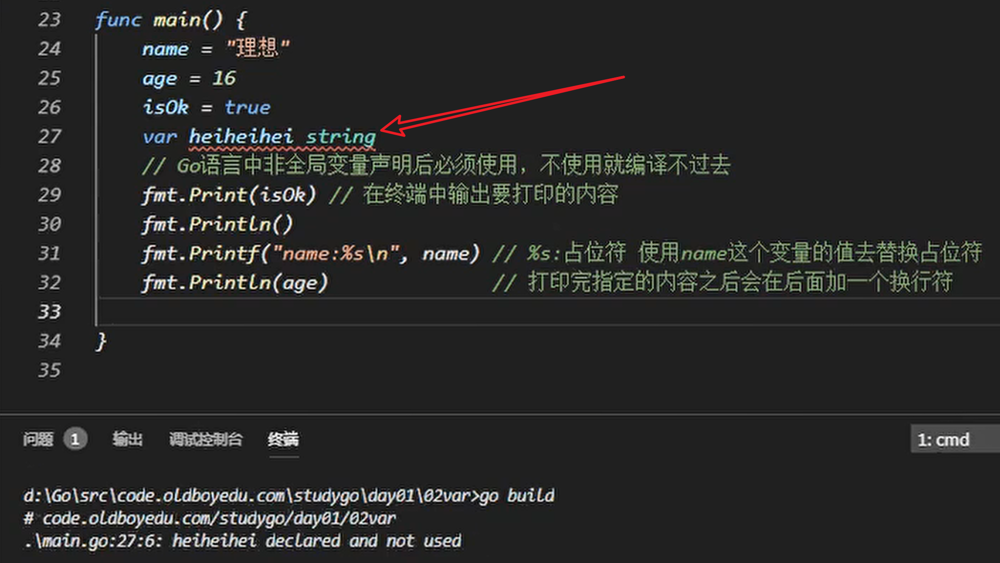
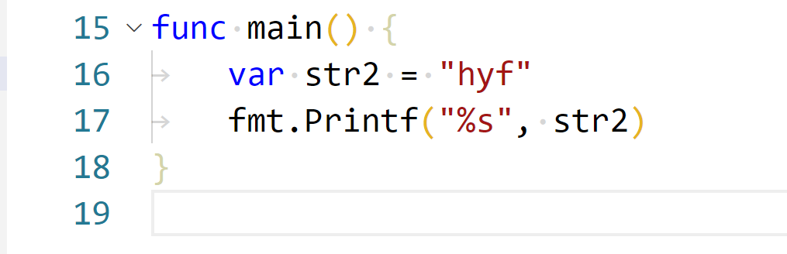
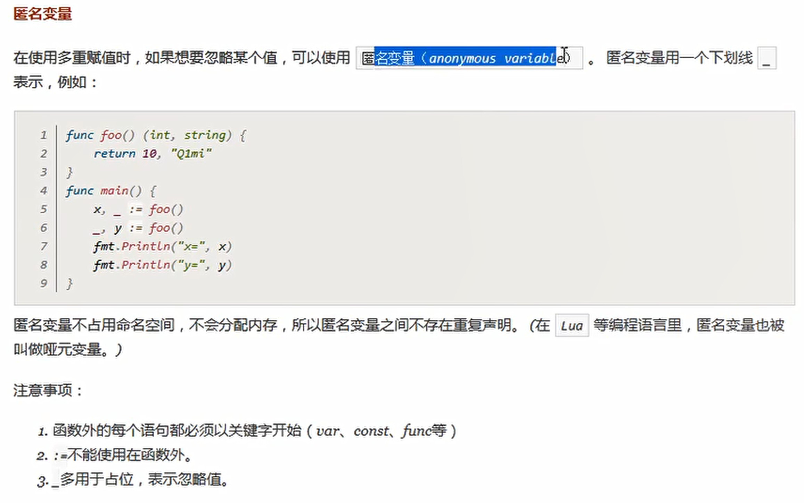
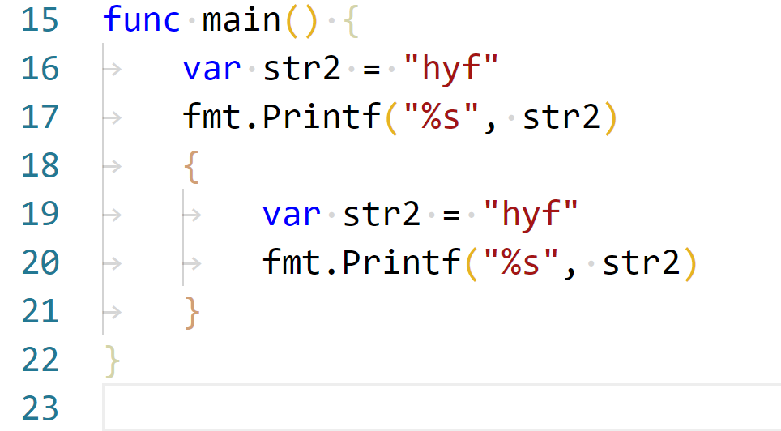

# 变量赋值

* 全局变量可以声明不使用
* 局部变量声明后必须使用



## 声明变量同时赋值


## 类型推导

* 根据变量值推到变量类型



## 短变量声明

* 只能在函数中使用，不能在函数外部
* 变量只能在函数内部访问
* 短变量不能以var开头？

```
var := value
```

## 匿名变量

* ```_```代表匿名变量



## 作用域内的变量不能重复声明

* 位于同一个花括号内部的就是同一个作用域




---
