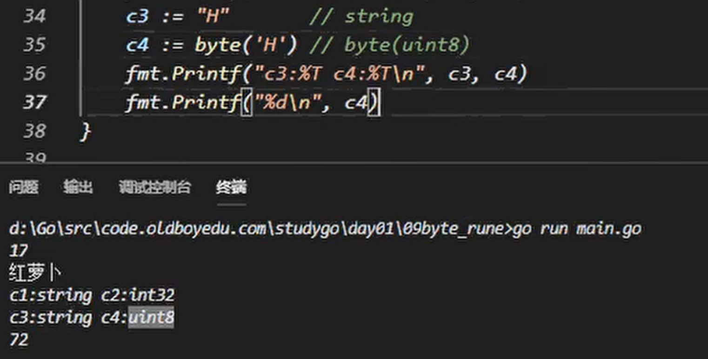

# 字符串修改及类型转换

组成每个字符串的元素叫做“字符”，可以通过遍历或者单个获取字符串元素获得字符。 字符用单引号（’）包裹起来，如：
```
var a := '中'
var b := 'x'
```
Go 语言的字符有以下两种：

* uint8类型，或者叫 byte 型，代表了ASCII码的一个字符。
vrune类型，代表一个 UTF-8字符。


当需要处理中文、日文或者其他复合字符时，则需要用到rune类型。rune类型实际是一个int32。

Go 使用了特殊的 rune 类型来处理 Unicode，让基于 Unicode 的文本处理更为方便，也可以使用 byte 型进行默认字符串处理，性能和扩展性都有照顾。


## 字符串修改

要修改字符串，需要先将其转换成[]rune或[]byte，完成后再转换为string。无论哪种转换，都会重新分配内存，并复制字节数组。

强制类型转换的基本语法如下：
```
T(表达式)
```
其中，T表示要转换的类型。表达式包括变量、复杂算子和函数返回值等.


* rune 就是int32别名，4个字节表示中文


* byte本质是是uint8



## 类型转换

* 能转换的才能强转，bool不能转其他


---
