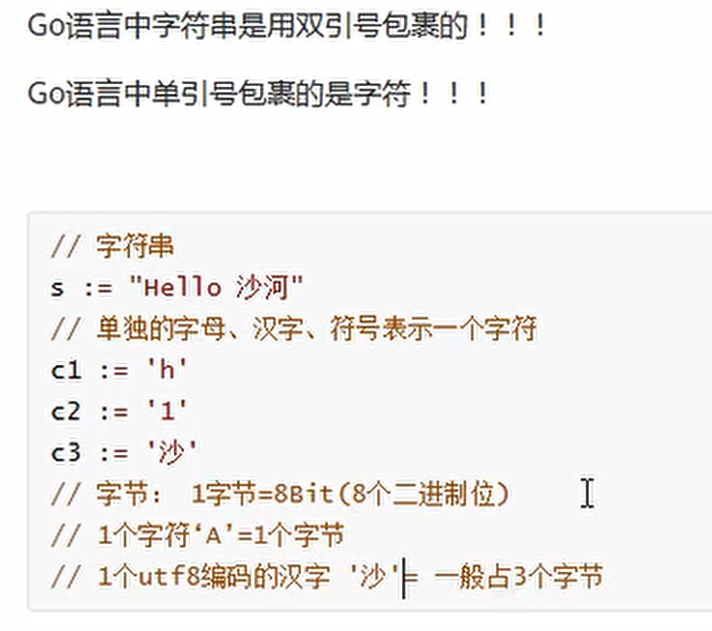

# 字符串操作

* Go语言中的字符串以原生数据类型出现，使用字符串就像使用其他原生数据类型（int、bool、float32、float64 等）一样。
* Go 语言里的字符串的内部实现使用UTF-8编码。 字符串的值为双引号(")中的内容，可以在Go语言的源码中直接添加非ASCII码字符，例如：

```
s1 := "hello"
s2 := "你好"
```

## 字符和字符串

* 单引号 == 字符
* 双引号 == 字符串



## 字符串转义

* 双引号中单引号没问题，不需要转义
* 单引号中双引号不可以


* 字符串必须双引号，字符才能单引号


## 多行字符串


* 多个`怎么办？不支持，也就是多行字符串不能包含`


## 字符串常用操作


 


---
