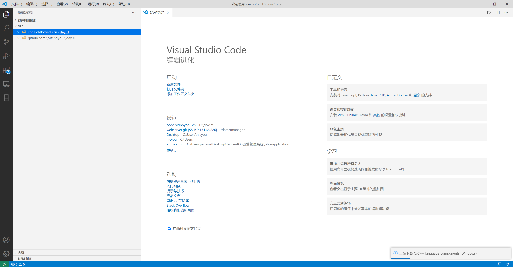
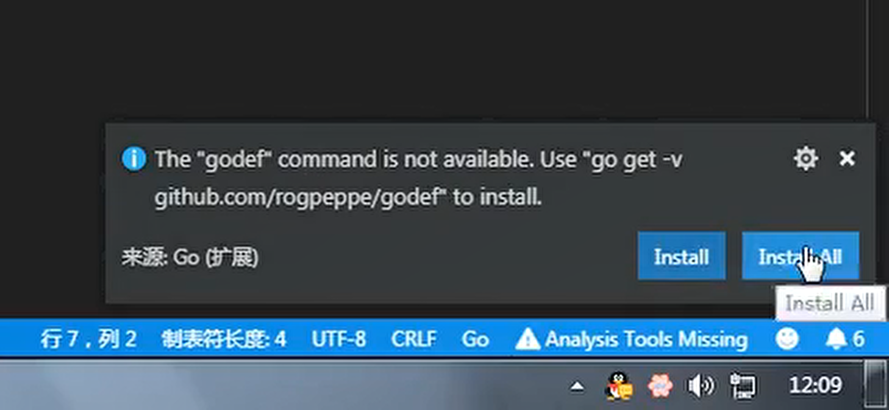

# 安装VSCode编辑器

Go采用的是UTF-8编码的文本文件存放源代码，理论上使用任何一款文本编辑器都可以做Go语言开发，这里推荐使用VS Code和Goland。 VS Code是微软开源的编辑器，而Goland是jetbrains出品的付费IDE。

## VSCode

VS Code全称Visual Studio Code，是微软公司开源的一款免费现代化轻量级代码编辑器，支持几乎所有主流的开发语言的语法高亮、智能代码补全、自定义热键、括号匹配、代码片段、代码对比 Diff、GIT 等特性，支持插件扩展，支持 Win、Mac 以及 Linux平台。

* <https://code.visualstudio.com/Download>





## 必装插件


## VSCode安装go插件



* 国内网路环境限制，99%情况会失败

```
cd $GOPATH/src
mkdir github.com
cd $GOPATH/src/github.com
mkdir acroca cweill derekparker go-delve josharian karrick mdempsky pkg ramya-rao-a rogpeppe sqs uudashr
cd $GOPATH/src/github.com/acroca
git clone https://github.com/acroca/go-symbols.git
cd $GOPATH/src/github.com/cweill
git clone https://github.com/cweill/gotests.git
cd $GOPATH/src/github.com/derekparker
git clone https://github.com/derekparker/delve.git
cd $GOPATH/src/github.com/go-delve
git clone https://github.com/go-delve\delve.git
cd $GOPATH/src/github.com/josharian
git clone https://github.com/josharian/impl.git
cd $GOPATH/src/github.com/karrick
git clone https://github.com/karrick/godirwalk.git
cd $GOPATH/src/github.com/mdempsky
git clone https://github.com/mdempsky/gocode.git
cd $GOPATH/src/github.com/pkg
git clone https://github.com/pkg/errors.git
cd $GOPATH/src/github.com/ramya-rao-a
git clone https://github.com/ramya-rao-a/go-outline.git
cd $GOPATH/src/github.com/rogpeppe
git clone https://github.com/rogpeppe/godef.git
cd $GOPATH/src/github.com/sqs
git clone https://github.com/sqs/goreturns.git
cd $GOPATH/src/github.com/uudashr
git clone https://github.com/uudashr/gopkgs.git

cd $GOPATH/src
mkdir -p golang.org/x
cd golang.org/x
git clone https://github.com/golang/tools.git
git clone https://github.com/golang/lint.git

cd $GOPATH/src
go install github.com/mdempsky/gocode
go install github.com/uudashr/gopkgs/cmd/gopkgs
go install github.com/ramya-rao-a/go-outline
go install github.com/acroca/go-symbols
go install github.com/rogpeppe/godef
go install github.com/sqs/goreturns
go install github.com/derekparker/delve/cmd/dlv
go install github.com/cweill/gotests
go install github.com/josharian/impl
go install golang.org/x/tools/cmd/guru
go install golang.org/x/tools/cmd/gorename
go install golang.org/x/lint/golint
```


## 使用技巧

* 自动保存


* 配置打开终端快捷键


安装git bash，默认使用。其他都是辣鸡


配置键绑定


```alt+t``` 直接打开终端

* 显示目录树


## 参考

* <https://www.liwenzhou.com/posts/Go/install_go_dev_old/>
* <https://www.liwenzhou.com/posts/Go/00_go_in_vscode/>
