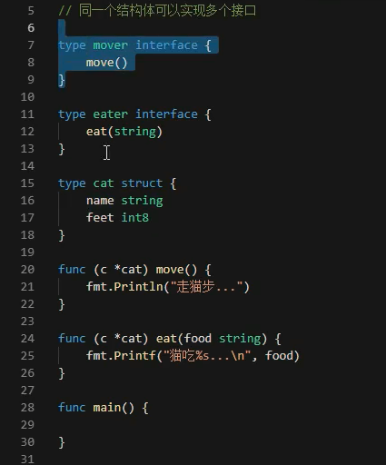
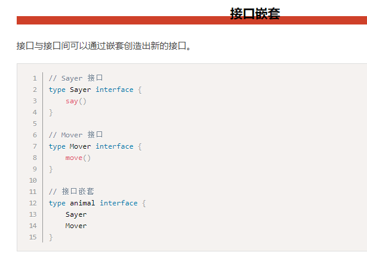
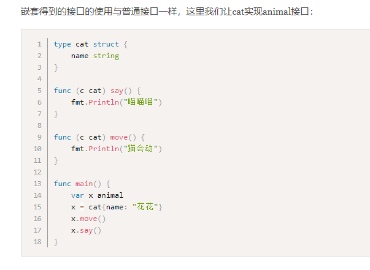

# 实现多个接口和接口嵌套

## 类型和接口的关系

* 多个类型可以实现同一个接口
* 一个类型可以实现多个接口

## 接口嵌套

* 接口定义规则，符合要求的就是实现了该接口
* 代码里无法直接给接口，而是要编程人员注意接口，这有点蛋疼
* java里面implement接口，那么类定义不完整就尴尬了
* 接口定义了你该干什么干什么，但是具体属性没有给出，只要求方法
* 接口是一种协议，实现可以有N多种

---
