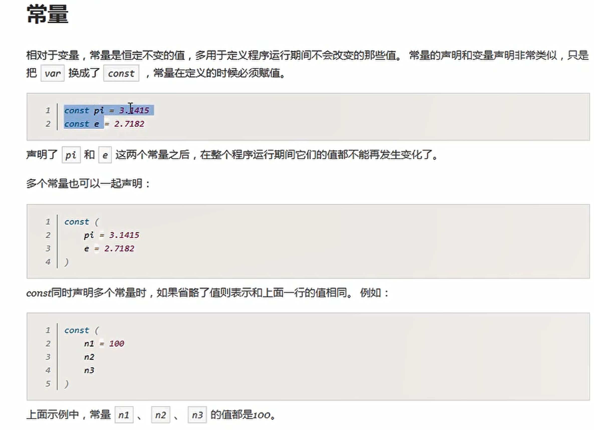
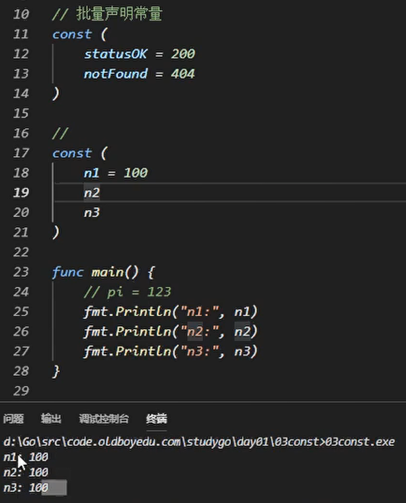
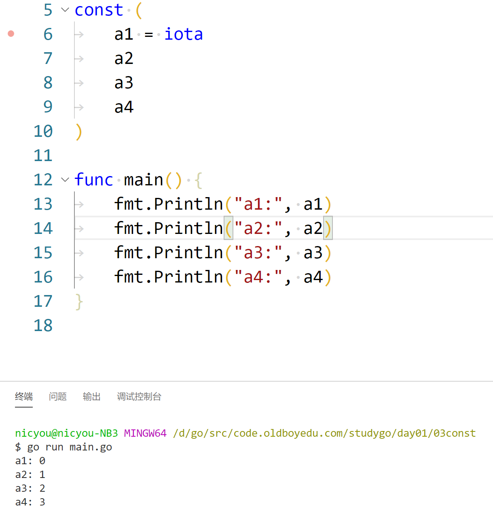
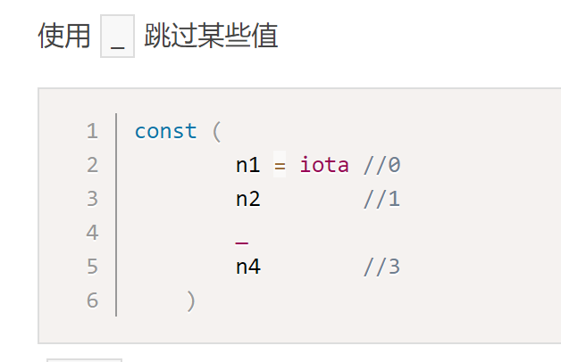
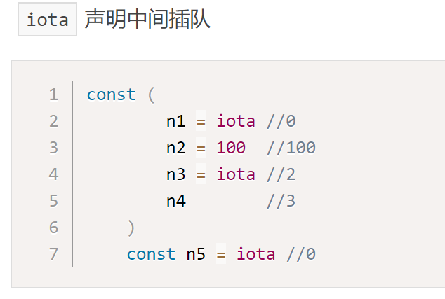
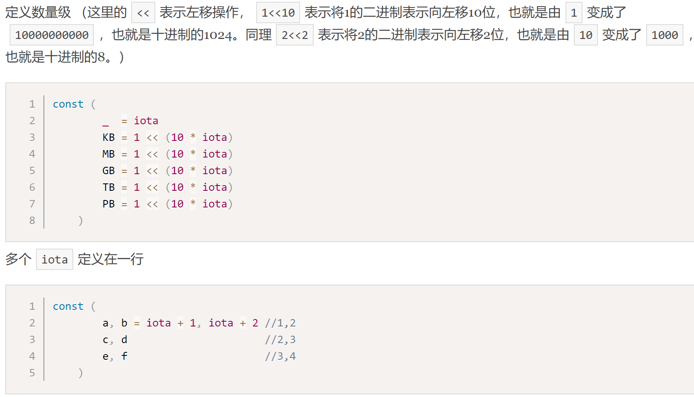

# 常量和iota

## 常量

* 常量就是运行过程中恒定不变的量，例如蓝屏代码

* 批量声明常量时，如果某一行声明后没有赋值默认就和**上一行**一致

## iota

* 常量计数器
* const出现时重置为0，之后陆续+1
* 之后每新增一行+1，如果多个变量同行，则iota值相同
* 中途不适用iota，但默认iota值也会+1,

## 几个常见的iota示例

---
