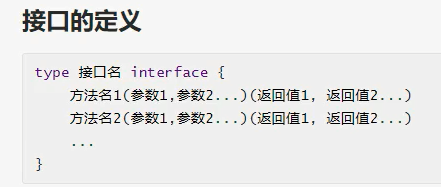

# 接口的定义与实现

* 接口是一种类型
* 接口是go的关键。接口名字中文翻译不友好
* 接口没有存储值，约束了变量应该有的方法

## 接口定义

* 类型，可以有type定义

* 用来给变量\参数\返回值等设置类型来用

## 接口的实现

* 一个变量如果满足接口的所有方法，可以更多，那么这个变量符合这个接口，或者成为这个接口的变量

## 接口类型的变量

* 可以多态，既可以赋值给阿猫，也可以赋值给阿狗
* 接口不关心数据，接口关心方法

* 报错很明显

* 接口赋值后类型变了？

## 接口的底层原理

* 接口变量保存了类型和对应类型的值

* 接口类型变量可以存任何值就是因为存了目标类型以及目标类型值

* 初始动态值和引用都是nil

---
