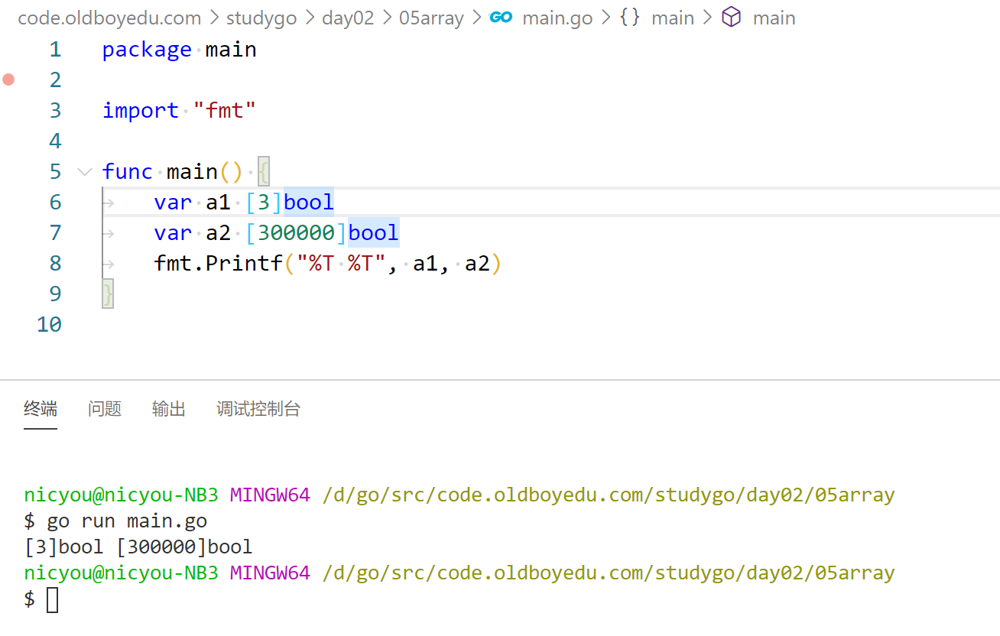
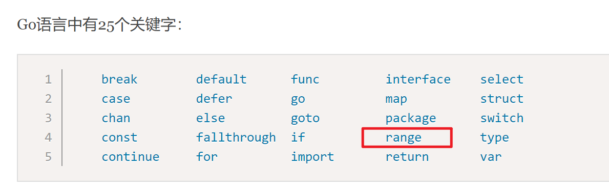
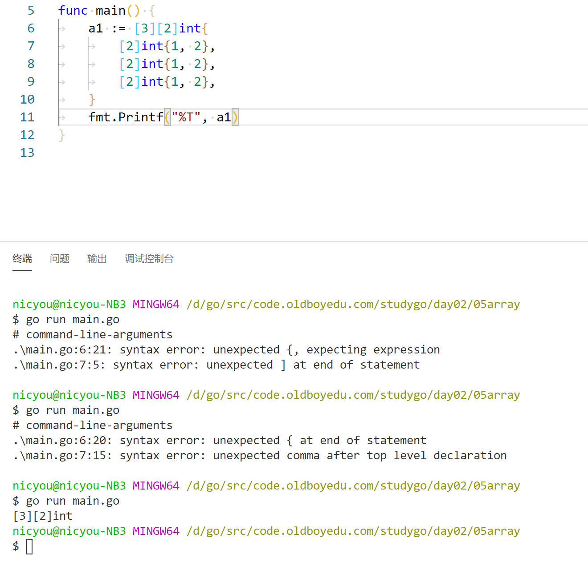
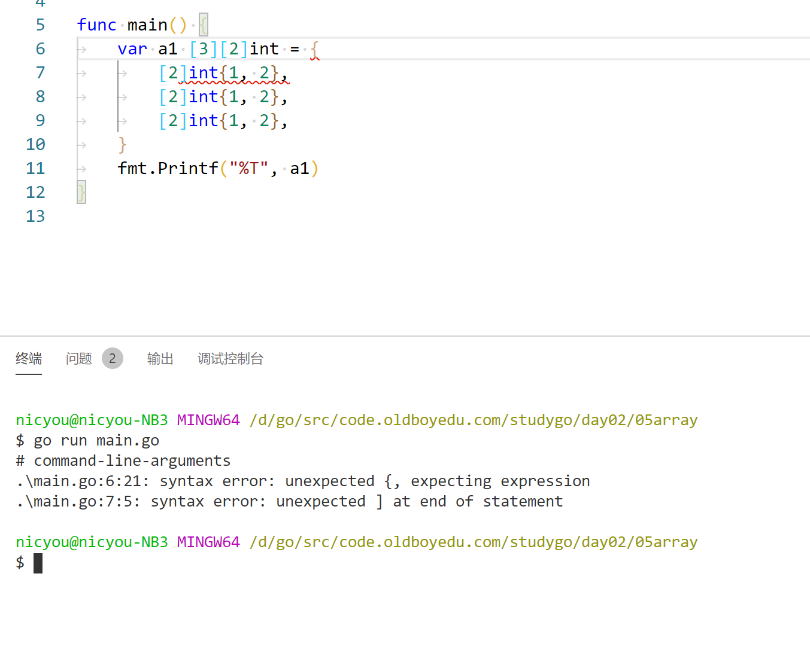
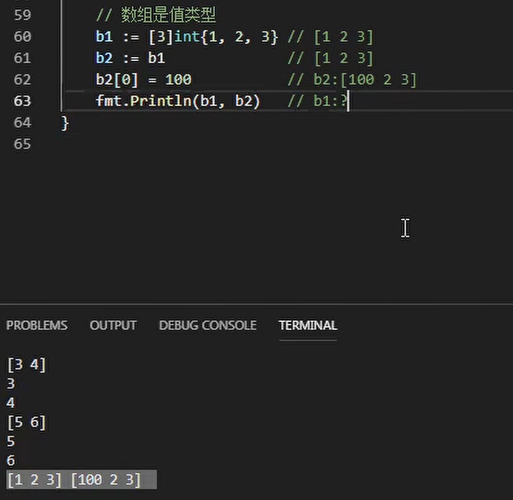

# 数组

## 数组的声明

* 数组相当于容器，存放基本数据类型
  - 字符串
  - 布尔值
  - 整型
  - 浮点型
* 容器长度固定，且初始化时指定
* 一个数组只能存放一种类型的数据，或者说专门存放某种类型的容器

```
var a1 [3]bool
```

```
var 数组变量名 [数组长度]数据类型
```

声明数组，3个元素，都是bool值



* **数组长度是数组类型的不可分割的一部分**

## 数组的初始化

* 声明之后变量要配置初始值，一般用默认也可以，但是默认相当于变量未使用，而初始化相当于变量已经使用，不会报错？不是，赋值不是使用，使用是作为右值

1. 直接给数组长度和值

```
var b1 [3]bool = {true,true,false}
```

2. 自动推断数组长度

```
var b1 [3]bool = {true,true,false}
```
等价于，...将根据初始值自动推断长度
```
var b1 [...]bool = {true,true,false}
```

2. 根据索引初始化，其他使用默认值

```
var b2 [1000]int = {99:123,89:12}
```

## 数组的遍历

遍历数组a有以下两种方法：

* len(数组) 获取数组长度
* range 关键字

```
func main() {
	var a = [...]string{"北京", "上海", "深圳"}
	// 方法1：for循环遍历
	for i := 0; i < len(a); i++ {
		fmt.Println(a[i])
	}

	// 方法2：for range遍历
	for index, value := range a {
		fmt.Println(index, value)
	}
}
```




## 多维数组

Go语言是支持多维数组的，我们这里以二维数组为例（数组中又嵌套数组）。

二维数组的定义

```
func main() {
	a := [3][2]string{
		{"北京", "上海"},
		{"广州", "深圳"},
		{"成都", "重庆"},
	}
	fmt.Println(a) //[[北京 上海] [广州 深圳] [成都 重庆]]
	fmt.Println(a[2][1]) //支持索引取值:重庆
}
```

* 多维数组就是数组里面定义数组






## 二维数组的遍历
```
func main() {
	a := [3][2]string{
		{"北京", "上海"},
		{"广州", "深圳"},
		{"成都", "重庆"},
	}
	for _, v1 := range a {
		for _, v2 := range v1 {
			fmt.Printf("%s\t", v2)
		}
		fmt.Println()
	}
}
```
输出：
```
北京	上海
广州	深圳
成都	重庆
```

注意： 多维数组只有第一层可以使用...来让编译器推导数组长度。例如：

//支持的写法
```
a := [...][2]string{
	{"北京", "上海"},
	{"广州", "深圳"},
	{"成都", "重庆"},
}
```
//不支持多维数组的内层使用...
```
b := [3][...]string{
	{"北京", "上海"},
	{"广州", "深圳"},
	{"成都", "重庆"},
}
```

## 数组是值类型

* 数组是值类型，赋值和传参会复制整个数组。因此改变副本的值，不会改变本身的值。
* 数组拷贝是赋值拷贝

```
func modifyArray(x [3]int) {
	x[0] = 100
}

func modifyArray2(x [3][2]int) {
	x[2][0] = 100
}
func main() {
	a := [3]int{10, 20, 30}
	modifyArray(a) //在modify中修改的是a的副本x
	fmt.Println(a) //[10 20 30]
	b := [3][2]int{
		{1, 1},
		{1, 1},
		{1, 1},
	}
	modifyArray2(b) //在modify中修改的是b的副本x
	fmt.Println(b)  //[[1 1] [1 1] [1 1]]
}
```
注意：

* 数组支持 “==“、”!=” 操作符，因为内存总是被初始化过的。
* [n]*T表示指针数组，*[n]T表示数组指针 。




---
