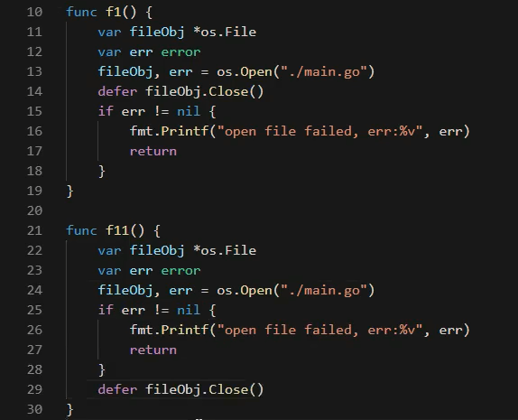

# 日志作业实现

* 只有真正努力过的人才知道天赋的重要

## 今日内容


## 内容回顾

* 包
  - package
  - import导入包
    - 包一般以文件夹为单位，一个目录先属于一个包
    - 包名可以和文件夹不同名，但是要符合标识符
    - 不符合标识符就起别名
  - 匿名导入 - sql导入时用到
  - 起别名
  - 包中标识符，大写能被外部使用，小写属于包内
  - init()函数
    - 包导入会自动执行
    - 一个包只有一个init函数
    - init没有参数也没有返回值
    - init不能手动调用
    - 多个包init执行顺序
    - 不能循环引用，不支持循环导入
  - 包导入路径是从```$GOPATH/src```目录下开始导入
* 接口
  - 接口是一种类型，是一种抽象类型
  - 接口变量，规定了要实现的方法
  - 接口的定义
    - type 接口名称er {}
    - 接口中只需要给方法的签名
      - 方法的签名，需要方法名称，参数，返回值
  - 接口的实现
    - 实现了接口的所有方法，就实现了接口
    - 实现了接口就可以当成接口的类型变量
  - 接口变量
    - 所有实现了接口的类型都是接口变量，万能变量，可以保存所有实现了接口类型的值
    - 通常作为函数参数实现
  - 空接口
    - 不需要方法的接口，那么所有类型都实现了这个接口
    - interface {}
      - 相当于C语言的void *
      - 相当于Java的Object类
    - 作为函数参数
      - map[string]interface{}
      - fmt.Println(interface{})
  - 接口底层
    - 动态类型
      - 底层保存分为类型和值，也就是接口变量不单单有值，还存类型
    - 动态值
  - 类型断言
    - 函数里面判断接口变量的值是什么类型
    - 能做断言一定是接口
    - if o,ok:=i.(TypeName);ok{}


## 类型断言


* v,ok : = 变量.(TypeName)

## 文件操作


* 打开/关闭文件
  - 通过OS去操作文件，底层文件系统细节屏蔽，对上层统一接口
  - file = os.OpenFile
  - file = os.Open("/a/b/c/d/e/f/main.go")
  - defer fileVariable.Close()
    - 文件一定要defer关闭，函数结束的时候退出
    - 函数即将要退出时候执行
  - 打开模式
    - RWONLY
    - RDONLY
    - TRUNCT
    - APPEND
* 读文件
  - 封装越高级局限越大，越不灵活
  - fileObj.Read()
  - bufio.NewReader()
  - ioutil.Read()
* 写文件
  - OpenFile 写权限
  -




* 应该先校验err之后校验是否为零值，然后再defer。否则fileobj是零值，再close会炸裂


* 读取是从缓冲区获取


## 日志库实现


---
