# 日志库简单实现

## go语言中的log

1. 函数Print系列(Print|Printf|Println）、
2. Fatal系列（Fatal|Fatalf|Fatalln）、
3. Panic系列（Panic|Panicf|Panicln）来使用

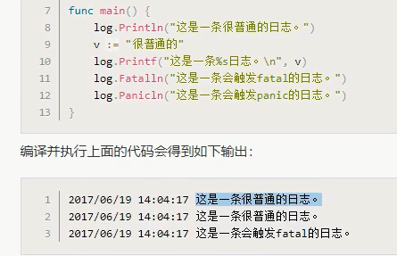

* logger会打印每条日志信息的日期、时间，默认输出到系统的标准错误。Fatal系列函数会在写入日志信息后调用os.Exit(1)。Panic系列函数会在写入日志信息后panic。

## 配置日志输出log.SetOutput

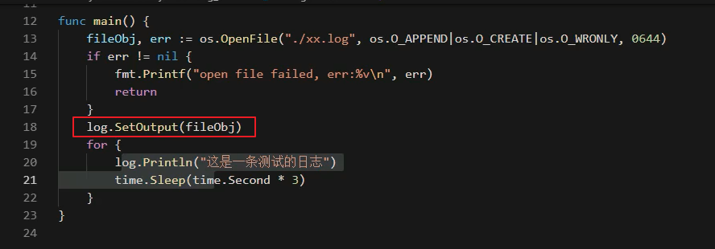

* 默认是写到StdOut

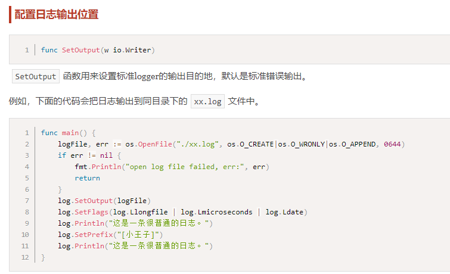

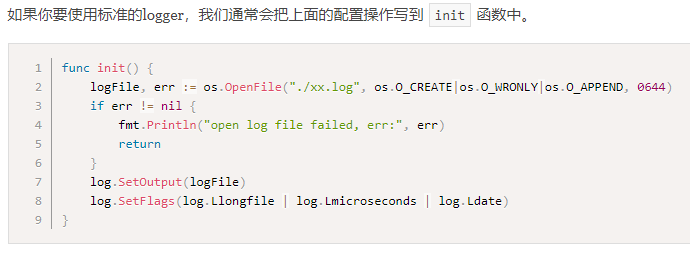

## 需求分析

* 输出到不同地方
* 日志级别，不同级别含义不同
* Fatal，致命错误
* 日志还需要有开关。开发环境，线上环境

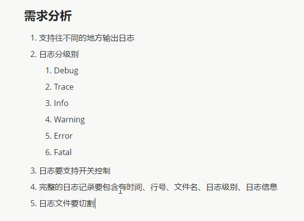

## 基本输出

## 增加时间戳

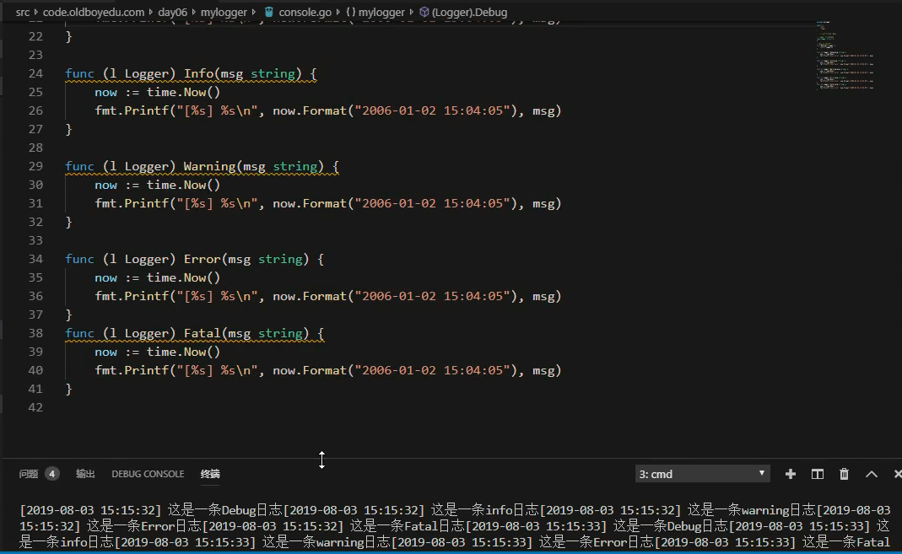

## 增加日志类型标识

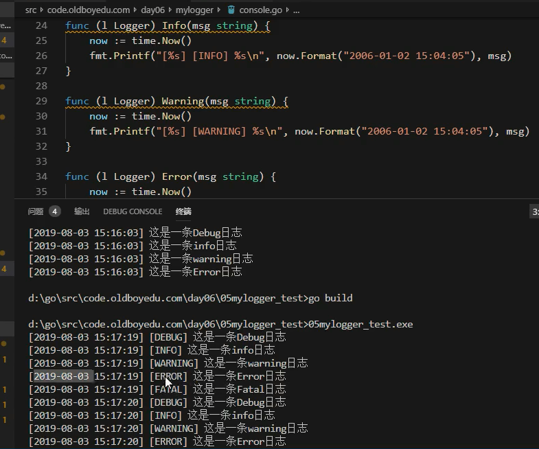

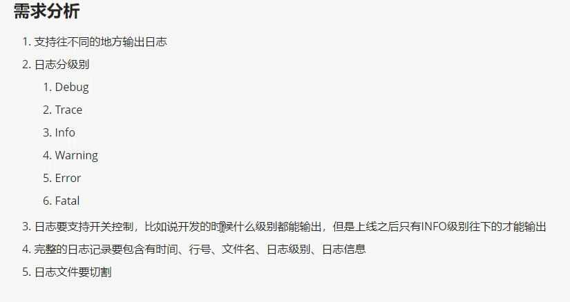

## 增加日志级别

* 解析级别参数

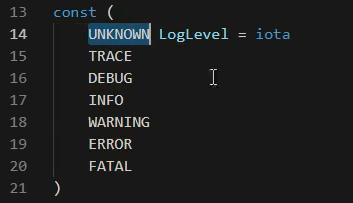

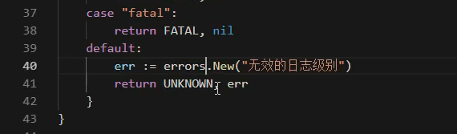

## 日志级别比较

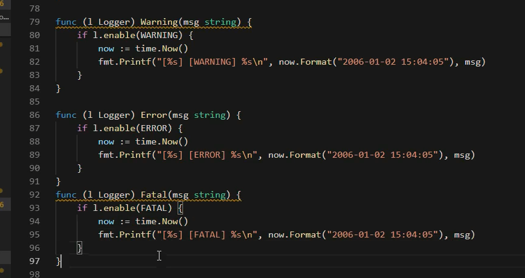

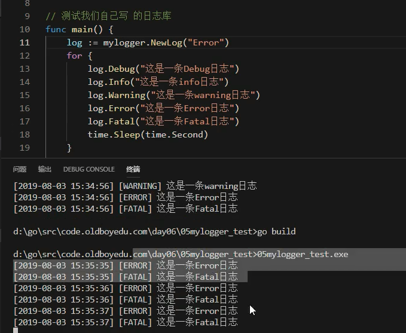

* 动态调整日志

---
