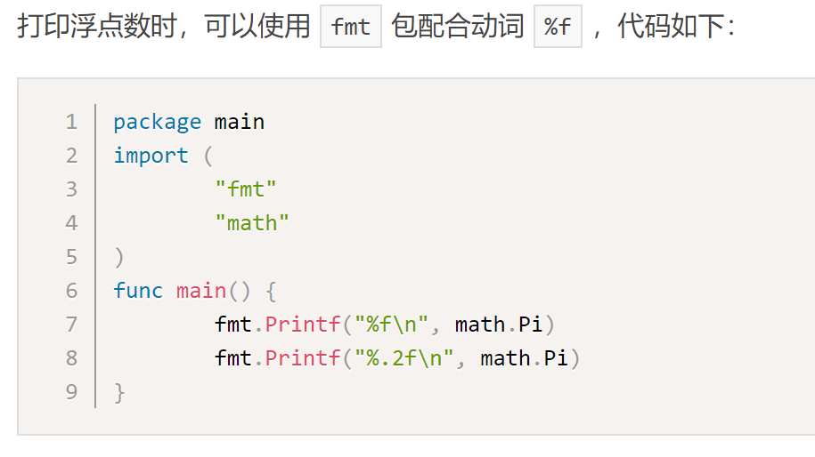
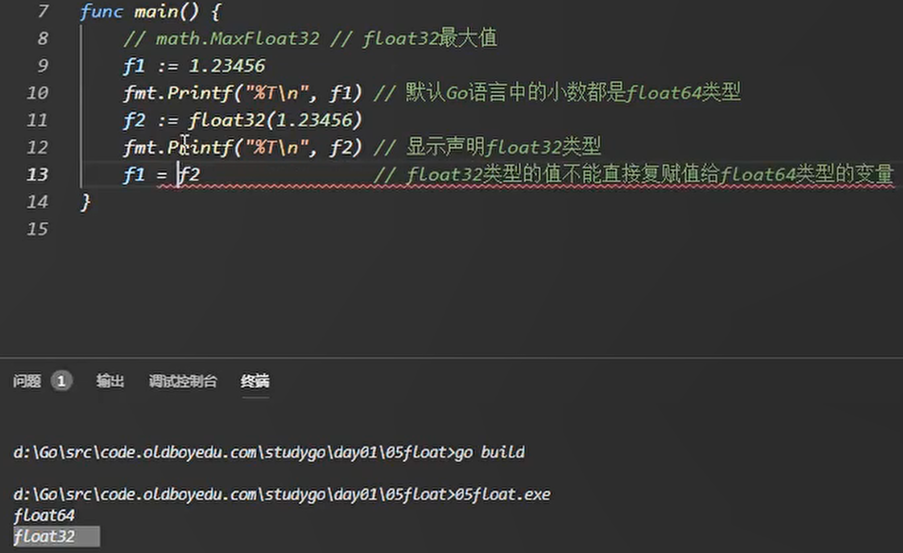
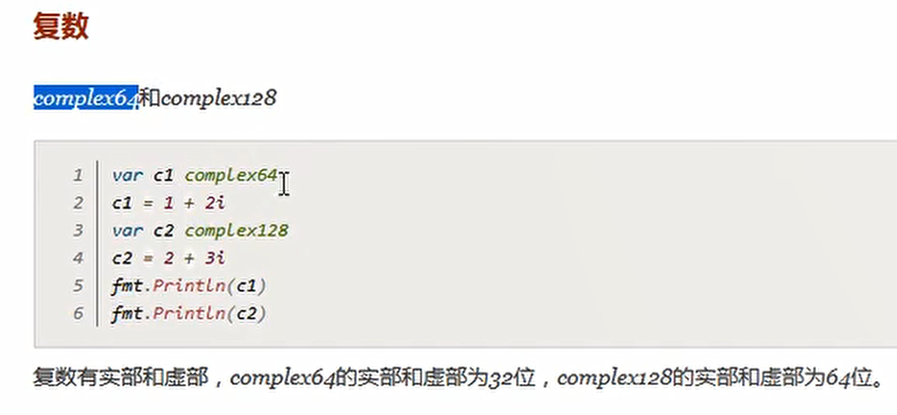
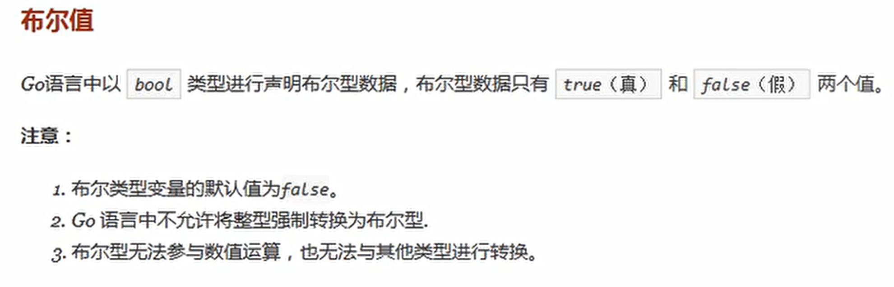
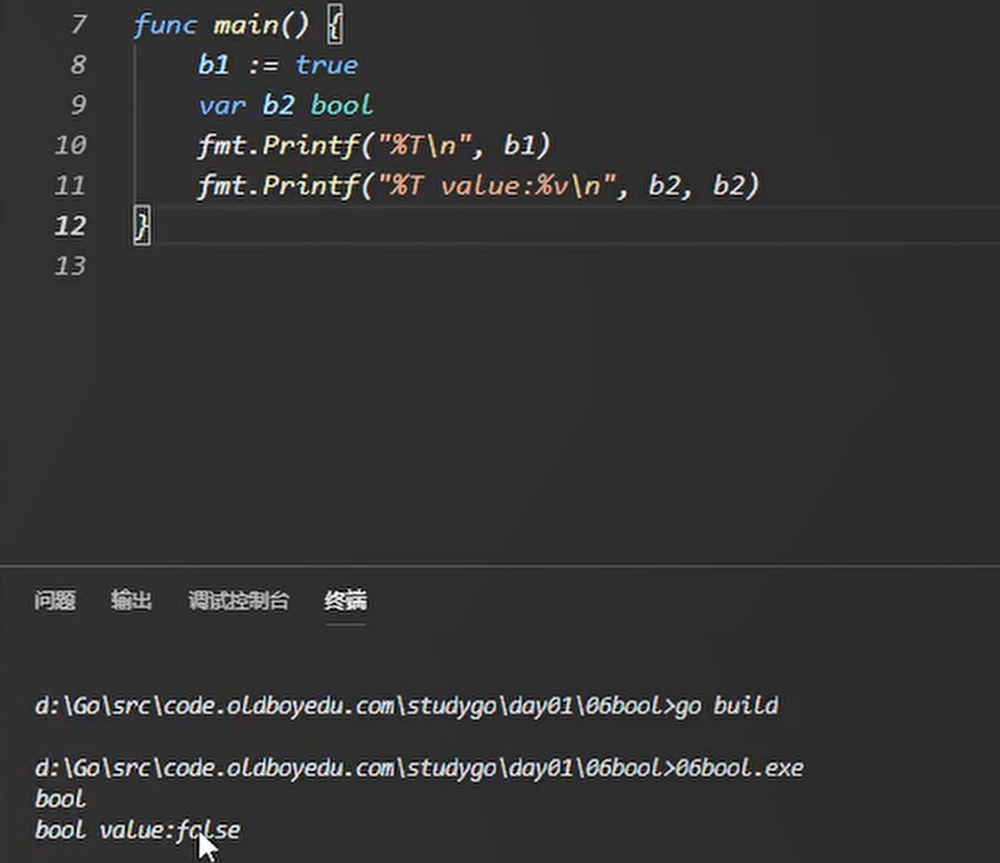

# 浮点型复数和布尔值

## 浮点型

* Go语言支持两种浮点型数：float32和float64。
* 这两种浮点型数据格式遵循IEEE 754标准： float32 的浮点数的最大范围约为 3.4e38，可以使用常量定义：math.MaxFloat32。 float64 的浮点数的最大范围约为 1.8e308，可以使用一个常量定义：math.MaxFloat64
* float32 的浮点数的最大范围约为 3.4e38，可以使用常量定义：math.MaxFloat32。
* float64 的浮点数的最大范围约为 1.8e308，可以使用一个常量定义：math.MaxFloat64。

## 复数

## 布尔值

* %v 打印变量的值，变量可以是任意变量

---
