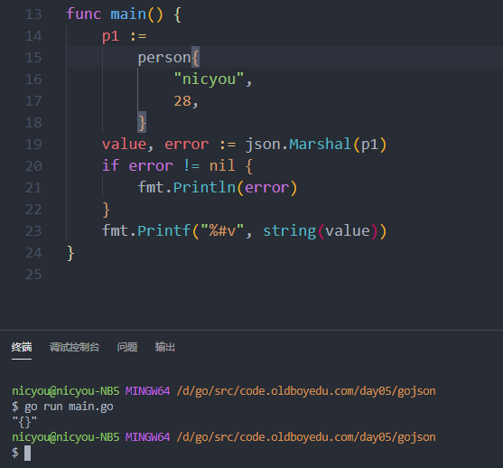
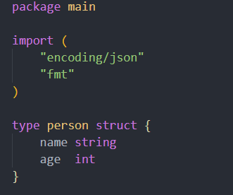
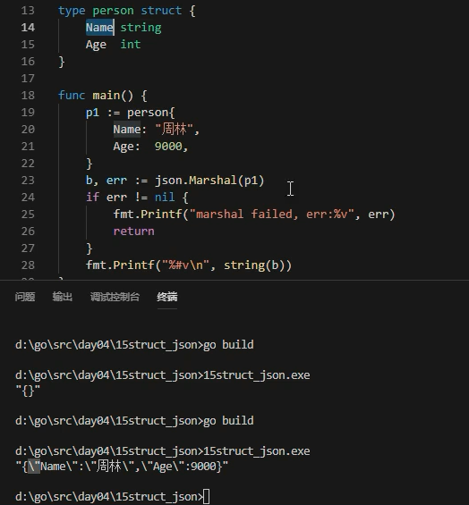
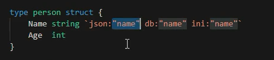
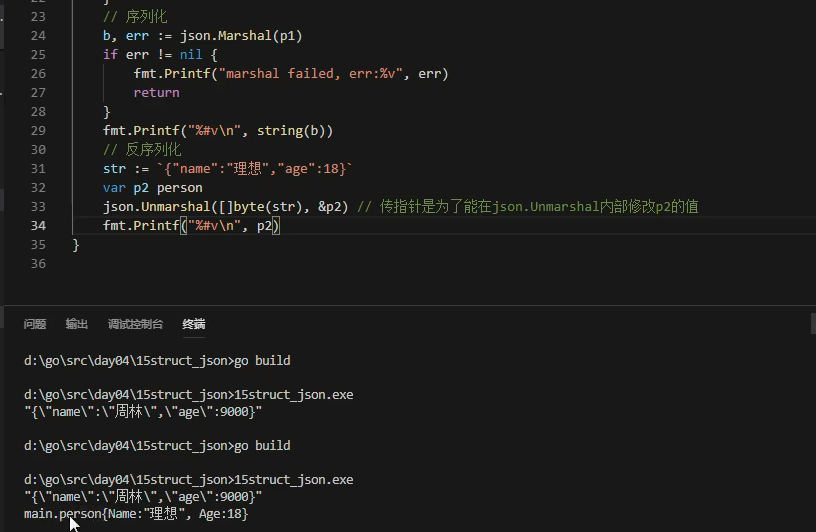

# 结构体与JSON

* javascript 跨语言对接格式

## marshal序列化

* 对象转字符串，序列化
* 字符串转对象，反序列化

## 常见json格式

* <http://www.json.cn>
* json格式比较简单且通用
* csv更简单

## go中struct结构体转json

* 小写标识符，不可见因此输出为空，改成大写就是了

* json包中Marshel函数中将对象转换为json字符串，对Marshel需要可见，因此需要大写

## 结构体特殊用法

* 定义特定环境使用不同名称

## json转为go能够识别的struct

* 反序列化，传指针

---
