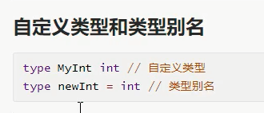

# 结构体内容回顾

## 匿名结构体=未命名类型=类型字面量

* 只用一次，定义变量同时声明结构体
* 省去了type的步骤

* 花括号，结构体定义的花括号，还有结构体赋值的花括号
* 匿名结构体多用于临时场景，不能复用

## 结构体初始化

* 批量初始化
* 逐个初始化
* 默认是各类型零值

* 结构体赋值一般用花括号

## 构造函数

* 构造函数，和自定义变量都可以
* 效果一致

* 本质就是一个函数

## 方法和接收者

* 方法是接收者的函数，接收者是那个类型的变量可以调用这个方法
* 本质就是函数

* 接收者可以是指针或者值类型

## 匿名嵌套

## JASON序列化，反序列化

* 常出现问题：
  - 首字母大写，外部可见，不然无法访问到
  - 访问不到就是空的

* 结构体定义，每类型后加tag

* 反序列化要传递指针

## 自定义类型和类型别名

* 类型别名只在代码编写过程有效，编译完还是原始类型，相当于做了字符串替换
* 自定义类型，编译后也在，与原始类型不共享方法，但是共享基本属性

---
