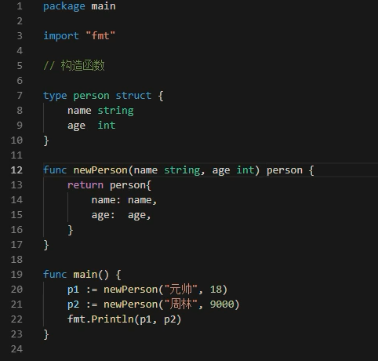
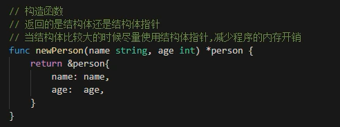
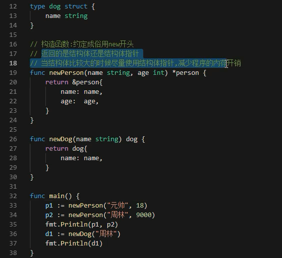
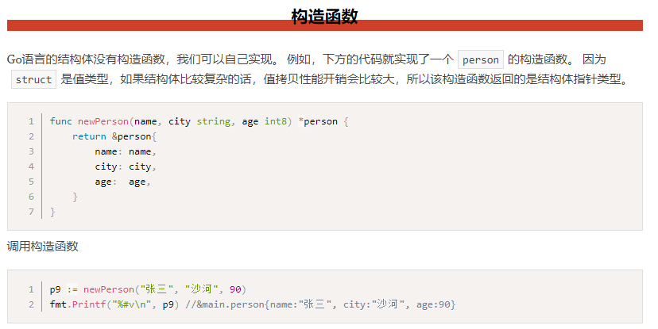
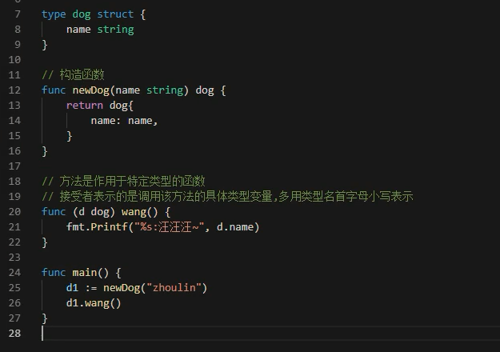

# 结构体和初始化

* go是面向接口编程
* go中使用结构体实现面向对象



* 结构体是值类型。如果结构体非常大，占用内存很大，更多使用结构体指针



* 构造函数一般是new开头





## 方法和接收者

Go语言中的方法（Method）是一种作用于特定类型变量的函数。这种特定类型变量叫做接收者（Receiver）。接收者的概念就类似于其他语言中的this或者 self。

方法的定义格式如下：
```
func (接收者变量 接收者类型) 方法名(参数列表) (返回参数) {
    函数体
}
```
其中，

1. 接收者变量：接收者中的参数变量名在命名时，官方建议使用接收者类型名称首字母的小写，而不是self、this之类的命名。例如，Person类型的接收者变量应该命名为 p，Connector类型的接收者变量应该命名为c等。
2. 接收者类型：接收者类型和参数类似，可以是指针类型和非指针类型。
3. 方法名、参数列表、返回参数：具体格式与函数定义相同。

* 方法区别于函数，方法作用于特定类型的函数。在函数基础上增加**(接收者变量 接收者类型) **




---
