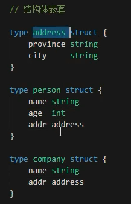

# 结构体的匿名字段结构体嵌套等

## 匿名字段

* 没有名称的字段，没有标识符的字段
* 必须有类型，将类型作为标识符使用
* 尽量不要使用，使用一般是字段少的情况，不然很容易冲突
* 不常用

## 结构体嵌套

* 结构体中包含结构体

* 定义无逗号，实例化有逗号

## 匿名嵌套结构体

* 特殊语法糖，直接访问子结构体变量

* 匿名嵌套会冲突，不常用
* 冲突怎么办？老老实实写全呗，只有这招

---
