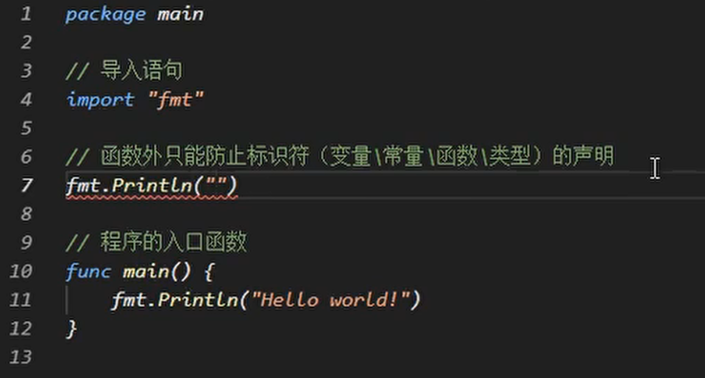
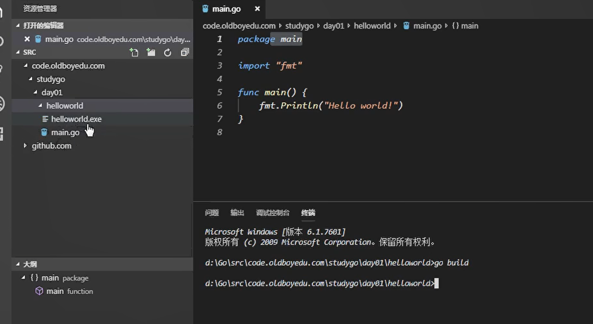
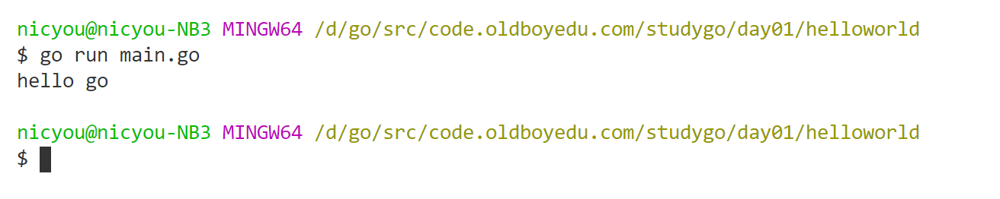
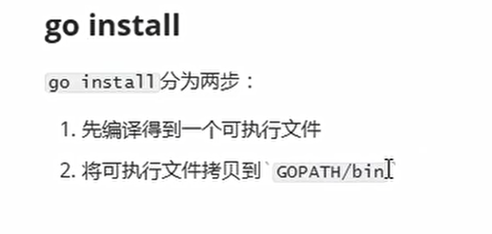

# 编写第一个Go语言程序

## 示例代码

```
package main

import (
	"fmt"
	"math/rand"
)

func main() {
	fmt.Println("hello go")
}
```

* main函数没有参数，也没有返回值
* main包是入口，可以编译到可执行
* main包必须有main函数作为入口
* import是导入语句，包括内部包，第三方包等
* 函数外面只能放申明语句，不能放逻辑语句。只能放标识符申明（变量，常量，类型）

 


## 编译

方式一：直接go build，编译当前目录



方式二：go build加路径，指定目标路径

go build code.oldboyedu.com/studygo/day01/helloworld

**$GOPATH 的src路径下找**

方式三：指定输出目标

```
go build -o fs.exe
```

方式三：编译后直接运行

```
go run main.go
```




* 可执行程序放到环境变量中```go install```,会放到$GOPATH/bin目录下，如果将该目录放到环境变量，则任意路径均可执行



## 跨平台编译

默认我们go build的可执行文件都是当前操作系统可执行的文件，如果我想在windows下编译一个linux下可执行文件，那需要怎么做呢？

只需要指定目标操作系统的平台和处理器架构即可：
```
SET CGO_ENABLED=0  // 禁用CGO
SET GOOS=linux  // 目标平台是linux
SET GOARCH=amd64  // 目标处理器架构是amd64
```
**使用了cgo的代码是不支持跨平台编译的**

然后再执行go build命令，得到的就是能够在Linux平台运行的可执行文件了。

Mac 下编译 Linux 和 Windows平台 64位 可执行程序：
```
CGO_ENABLED=0 GOOS=linux GOARCH=amd64 go build
CGO_ENABLED=0 GOOS=windows GOARCH=amd64 go build
```

Linux 下编译 Mac 和 Windows 平台64位可执行程序：
```
CGO_ENABLED=0 GOOS=darwin GOARCH=amd64 go build
CGO_ENABLED=0 GOOS=windows GOARCH=amd64 go build
```

Windows下编译Mac平台64位可执行程序：

```
SET CGO_ENABLED=0
SET GOOS=darwin
SET GOARCH=amd64
go build
```

## 参考

* <https://www.liwenzhou.com/posts/Go/install_go_dev/>


---
