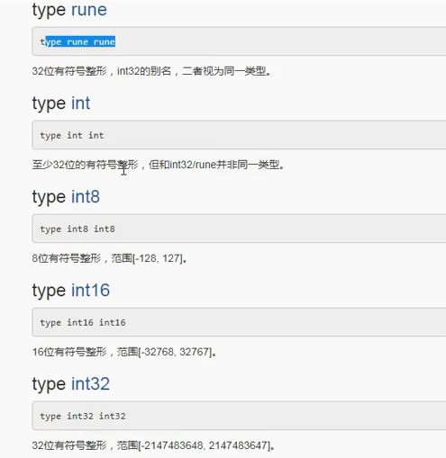

# 自定义类型和类型别名

* go语言是强类型


两种使用方法：

```
type D = int   // 类型别名
type I int    // 类型声明
```

## 类型别名

```
type rune=int32
```

* 仅仅是名称不一样，类型还是一致


## 类型定义




* 别名保留原类型属性方法
* 新类型，不具备原类型默认属性，有些情况需强制转换


---
