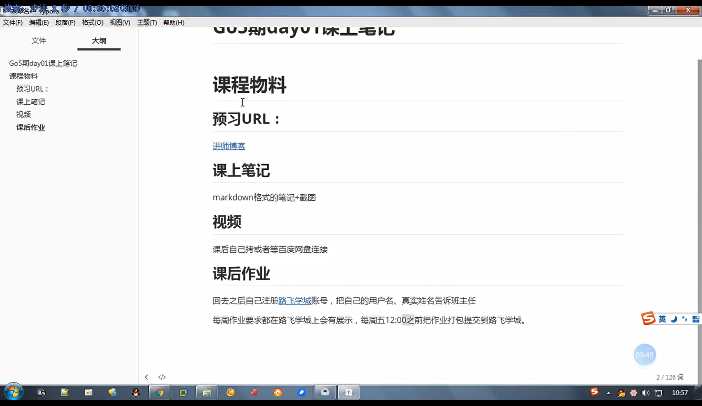

# 课上所有物料介绍

## 笔记使用Typora

* 图片存放到本地目录
* Typora支持中英文

## 博客

* <https://www.liwenzhou.com/>
* 提前预习下一节内容

## 课上笔记

* 使用markdown格式的笔记+截图

## 视频

* 加密

## 课后作业

* 老男孩，路飞学城<http://www.luffycity.com>

 

---
