# 闭包

## 函数

* 函数定义
* 函数基本格式
* 函数参数格式
* 函数类型，函数签名
* 可变参数
* 多返回值
* 命名返回值，匿名返回值
* 函数作为参数，函数作为返回值

## 高阶函数

* 函数是一种类型，可以作为参数，也可以作为返回值

## 变量作用域

* 全局作用域
* 局部作用域 {}
* 局部作用域 语句块

作用域顺序
1. 现在当前{}找，找不到则到上层{}找
2. 一直到全局作用域

## 匿名函数

* 没有名字的函数
* **go语言不能嵌套定义函数**

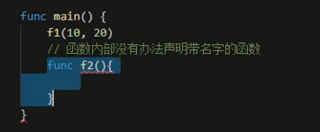

* go语言不能嵌套定义有名函数，但是匿名函数是可以定义的

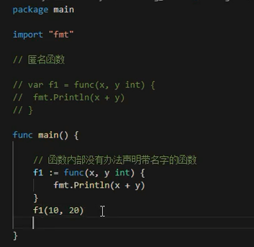

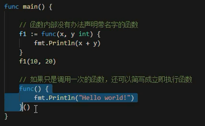

* 匿名函数只能调用一次？如果是函数变量，则可调用多次

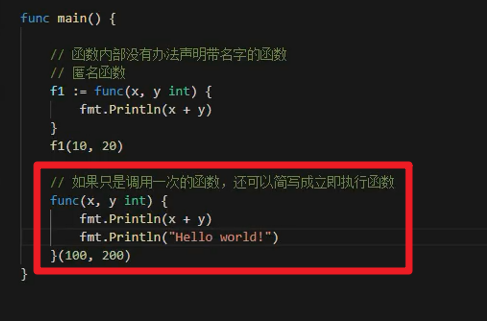

## 闭包

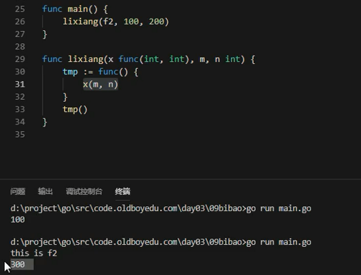

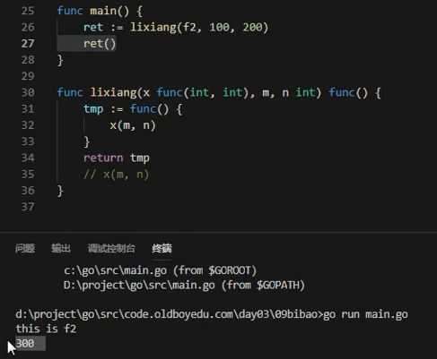

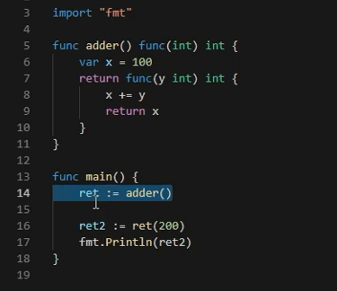

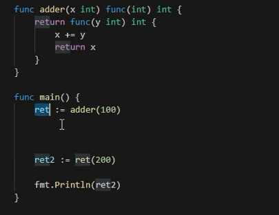

* 懂闭包前提
  - 函数变量 - 函数是引用类型
  - 变量作用域

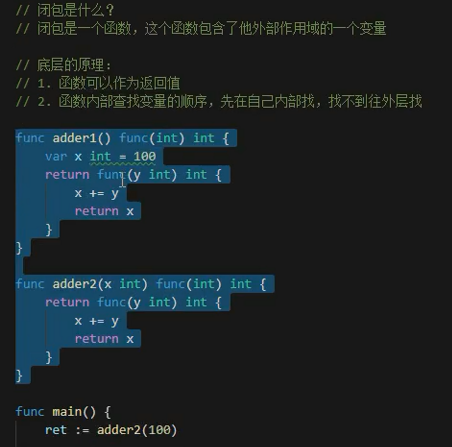

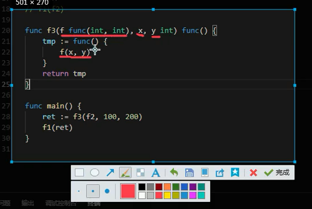

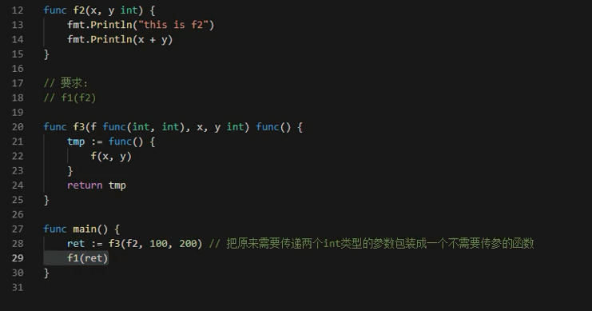

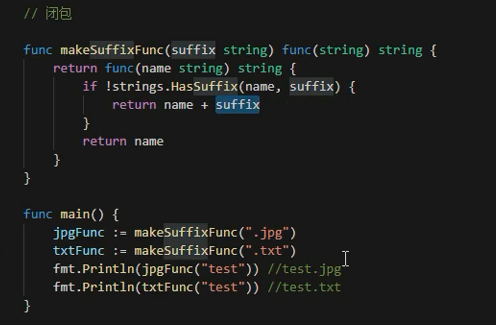

---

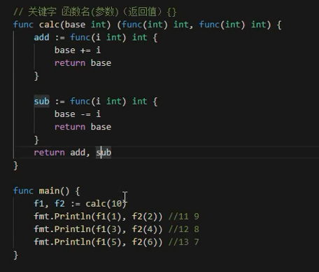 

---
