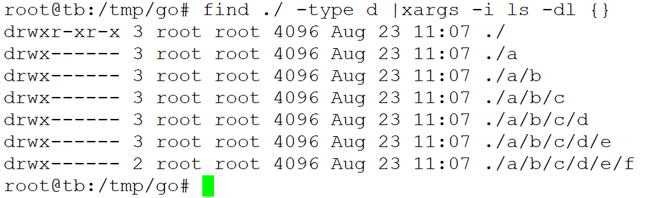
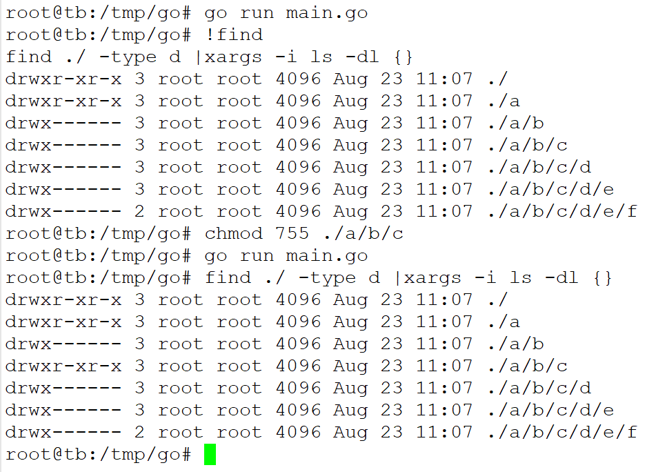
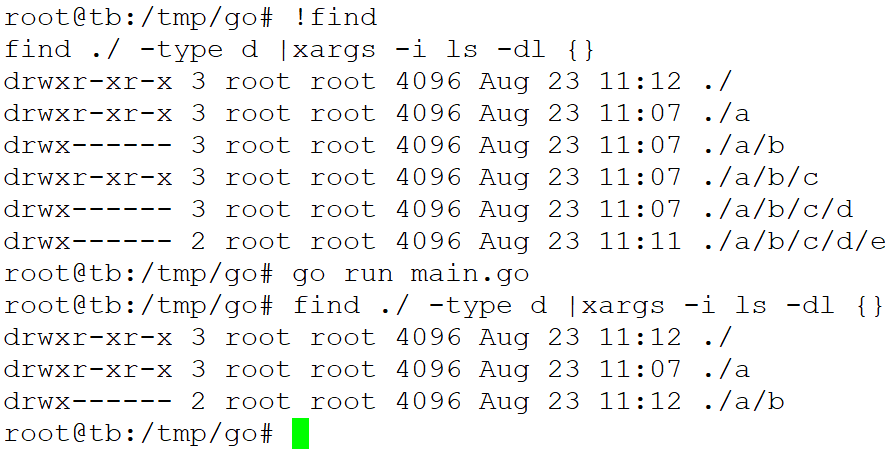

# os


## 内置变量

```
var (
    ErrInvalid    = errors.New("invalid argument")
    ErrPermission = errors.New("permission denied")
    ErrExist      = errors.New("file already exists")
    ErrNotExist   = errors.New("file does not exist")
)
```
一些可移植的、共有的系统调用错误。
```
var (
    Stdin  = NewFile(uintptr(syscall.Stdin), "/dev/stdin")
    Stdout = NewFile(uintptr(syscall.Stdout), "/dev/stdout")
    Stderr = NewFile(uintptr(syscall.Stderr), "/dev/stderr")
)
```
Stdin、Stdout和Stderr是指向标准输入、标准输出、标准错误输出的文件描述符。

```
var Args []string
```

* Args保管了命令行参数，第一个是程序名。
* 若要获取参数，常规做法是 ```os.Args[1:]```

实例：

```
fmt.Println(os.Args) // [./tmp/go/main 1 2 3 4]
```


## func Create(name string) (*File, error)

```
func main() {
    newFile, err = os.Create("test.txt")
    if err != nil {
        log.Fatal(err)
    }
    log.Println(newFile)
    newFile.Close()
}
```

## func Open(name string) (*File, error)
## func OpenFile(name string, flag int, perm FileMode) (*File, error)


```
func Open(name string) (*File, error) {
	return OpenFile(name, O_RDONLY, 0)
}
```


## func (f *File) Read(b []byte) (n int, err error)
## func ReadFile(name string) ([]byte, error)


## func (f *File) write(b []byte) (n int, err error)
## func WriteFile(name string, data []byte, perm FileMode) error

* write是File的方法，WriteFile是独立的函数
* WriteFile底层还是调用Write方法，根据name文件名打开文件，写入data，

```
func WriteFile(name string, data []byte, perm FileMode) error {
	f, err := OpenFile(name, O_WRONLY|O_CREATE|O_TRUNC, perm)
	if err != nil {
		return err
	}
	_, err = f.Write(data)
	if err1 := f.Close(); err1 != nil && err == nil {
		err = err1
	}
	return err
}
```


## func (f *File) Close() error


## func Getwd() (dir string, err error)

* 返回一个对应当前工作目录的根路径。
* 如果当前目录可以经过多条路径抵达（因为硬链接）， Getwd 会返回其中一个。


## func IsPermission(err error) bool

* 返回一个布尔值说明该错误是否表示因权限不足要求被拒绝

```
// IsPermission returns a boolean indicating whether the error is known to
// report that permission is denied. It is satisfied by ErrPermission as well
// as some syscall errors.
//
// This function predates errors.Is. It only supports errors returned by
// the os package. New code should use errors.Is(err, fs.ErrPermission).
func IsPermission(err error) bool {
	return underlyingErrorIs(err, ErrPermission)
}
```

```
func main() {
    // 这个例子测试写权限，如果没有写权限则返回error。
    // 注意文件不存在也会返回error，需要检查error的信息来获取到底是哪个错误导致。
    file, err := os.OpenFile("test.txt", os.O_WRONLY, 0666)
    if err != nil {
        if os.IsPermission(err) {
            log.Println("Error: Write permission denied.")
        }
    }
    file.Close()
    // 测试读权限
    file, err = os.OpenFile("test.txt", os.O_RDONLY, 0666)
    if err != nil {
        if os.IsPermission(err) {
            log.Println("Error: Read permission denied.")
        }
    }
    file.Close()
}
```


## func Stat(name string) (FileInfo, error)


```
// Stat returns a FileInfo describing the named file.
// If there is an error, it will be of type *PathError.
func Stat(name string) (FileInfo, error) {
	testlog.Stat(name)
	return statNolog(name)
}
```


## func IsExist(err error) bool
## func IsNotExist(err error) bool

* 返回一个布尔值说明该错误是否表示一个文件或目录已经存在。
* 返回一个布尔值说明该错误是否表示一个文件或目录不存在

```
// IsExist returns a boolean indicating whether the error is known to report
// that a file or directory already exists. It is satisfied by ErrExist as
// well as some syscall errors.
//
// This function predates errors.Is. It only supports errors returned by
// the os package. New code should use errors.Is(err, fs.ErrExist).
func IsExist(err error) bool {
	return underlyingErrorIs(err, ErrExist)
}

```


## func Mkdir(name string, perm FileMode) error
## func Remove(name string) error

* 使用指定的权限和名称创建一个目录，仅适用于创建父目录存在且要创建的目录不存在的情况。
* 如果要创建的目录已经存在，则会报错，如果出错，会返回 *PathError 底层类型的错误。
* 删除 name 指定的文件或目录。
* 如果是目录的话必须要求该目录为空才能删除，否则会报错，会返回 *PathError 底层类型的错误

## func MkdirAll(path string, perm FileMode) error
## func RemoveAll(path string) error


```
// MkdirAll creates a directory named path,
// along with any necessary parents, and returns nil,
// or else returns an error.
// The permission bits perm (before umask) are used for all
// directories that MkdirAll creates.
// If path is already a directory, MkdirAll does nothing
// and returns nil.
```


* 目录创建以及目录清空
* 所有路径权，只要是新创建的权限都是perm，否则不会改变
* perm仅作用于新创建的目录
* 删除，只需要提供路径，递归清空目录，同时包含`base string`目录也会删除
* 清空目录内容是保留目录，但是为空文件，与删除目录不同
* 如果是清空目录，怎么玩？删除目录后重建？


实例：

```
func main() {
	err := os.MkdirAll("a/b/c/d/e/f", 0700)
	if err != nil {
		fmt.Println("create dirs failed", err)
	}
}
```






```
func main() {
	//err := os.MkdirAll("a/b/c/d/e/f", 0700)
	err := os.RemoveAll("a/b/c/")
	if err != nil {
		fmt.Println("remove dirs failed", err)
	}
}
```





## 环境变量相关

### func LookupEnv(key string) (string, bool)

## func Exit(code int)

* 较为简单，直接退出返回状态码
* 调用 ```syscall.Exit(code)```
* 调用该函数，**defer 的函数不会被执行**
* 在协程中调用，中止整个进程!


## 参考

* <https://colobu.com/2016/10/12/go-file-operations/#%E5%88%9B%E5%BB%BA%E7%A9%BA%E6%96%87%E4%BB%B6>


---
