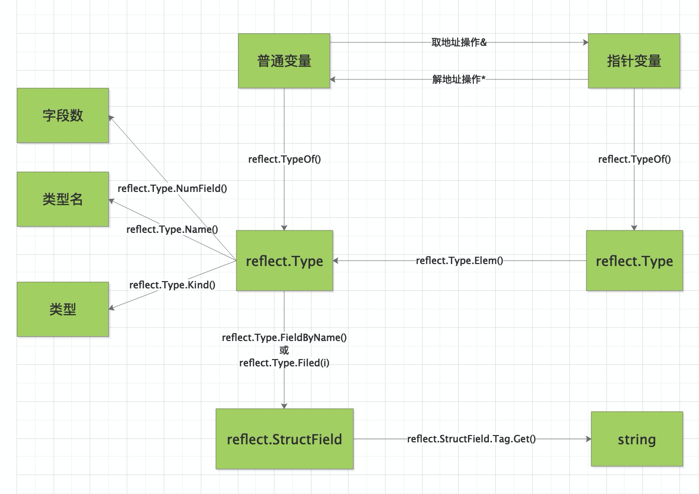

<!-- MDTOC maxdepth:6 firsth1:1 numbering:0 flatten:0 bullets:1 updateOnSave:1 -->

- [reflect](#reflect)   
   - [type Kind](#type-kind)   
   - [type Type](#type-type)   
      - [func TypeOf(i interface{}) Type](#func-typeofi-interface-type)   
   - [type Value](#type-value)   
      - [func ValueOf(i interface{}) Value](#func-valueofi-interface-value)   
      - [func (v Value) Recv() (x Value, ok bool)](#func-v-value-recv-x-value-ok-bool)   
      - [func (v Value) Elem() Value](#func-v-value-elem-value)   
   - [参考](#参考)   

<!-- /MDTOC -->
# reflect

* 变量包括 值信息（ValueOf） + 类型信息（TypeOf）。值信息操作方法更多，类型信息一般以查询为主。
* reflect包实现了运行时反射，允许程序操作任意类型的对象。
* 典型用法是用静态类型interface{}保存一个值，通过调用TypeOf获取其动态类型信息，该函数返回一个Type类型值。
* 调用ValueOf函数返回一个Value类型值，该值代表运行时的数据。
* Zero接受一个Type类型参数并返回一个代表该类型零值的Value类型值。

参见"The Laws of Reflection"获取go反射的介绍：http://golang.org/doc/articles/laws_of_reflection.html



## type Kind

```
type Kind uint
```

* 类型种类，是种类，不是具体类型名称。
* Kind代表Type类型值表示的具体分类。零值表示非法分类。

```
const (
    Invalid Kind = iota
    Bool
    Int
    Int8
    Int16
    Int32
    Int64
    Uint
    Uint8
    Uint16
    Uint32
    Uint64
    Uintptr
    Float32
    Float64
    Complex64
    Complex128
    Array
    Chan
    Func
    Interface
    Map
    Ptr
    Slice
    String
    Struct
    UnsafePointer
)
```


## type Type

* 获取Type类型，则类型信息基本都能获取到

```
type Type interface {
    // Kind返回该接口的具体分类
    Kind() Kind
    // Name返回该类型在自身包内的类型名，如果是**未命名类型会返回空字符串**
    Name() string
    // PkgPath返回类型的包路径，即明确指定包的import路径，如"encoding/base64"
    // 如果类型为内建类型(string, error)或未命名类型(*T, struct{}, []int)，会返回""
    PkgPath() string
    // 返回类型的字符串表示。该字符串可能会使用短包名（如用base64代替"encoding/base64"）
    // 也不保证每个类型的字符串表示不同。如果要比较两个类型是否相等，请直接用Type类型比较。
    String() string
    // 返回要保存一个该类型的值需要多少字节；类似unsafe.Sizeof
    Size() uintptr
    // 返回当从内存中申请一个该类型值时，会对齐的字节数
    Align() int
    // 返回当该类型作为结构体的字段时，会对齐的字节数
    FieldAlign() int
    // 如果该类型实现了u代表的接口，会返回真
    Implements(u Type) bool
    // 如果该类型的值可以直接赋值给u代表的类型，返回真
    AssignableTo(u Type) bool
    // 如该类型的值可以转换为u代表的类型，返回真
    ConvertibleTo(u Type) bool
    // 返回该类型的字位数。如果该类型的Kind不是Int、Uint、Float或Complex，会panic
    Bits() int
    // 返回array类型的长度，如非数组类型将panic
    Len() int
    // 返回该类型的元素类型，如果该类型的Kind不是Array、Chan、Map、Ptr或Slice，会panic
    Elem() Type
    // 返回map类型的键的类型。如非映射类型将panic
    Key() Type
    // 返回一个channel类型的方向，如非通道类型将会panic
    ChanDir() ChanDir
    // 返回struct类型的字段数（匿名字段算作一个字段），如非结构体类型将panic
    NumField() int
    // 返回struct类型的第i个字段的类型，如非结构体或者i不在[0, NumField())内将会panic
    Field(i int) StructField
    // 返回索引序列指定的嵌套字段的类型，
    // 等价于用索引中每个值链式调用本方法，如非结构体将会panic
    FieldByIndex(index []int) StructField
    // 返回该类型名为name的字段（会查找匿名字段及其子字段），
    // 布尔值说明是否找到，如非结构体将panic
    FieldByName(name string) (StructField, bool)
    // 返回该类型第一个字段名满足函数match的字段，布尔值说明是否找到，如非结构体将会panic
    FieldByNameFunc(match func(string) bool) (StructField, bool)
    // 如果函数类型的最后一个输入参数是"..."形式的参数，IsVariadic返回真
    // 如果这样，t.In(t.NumIn() - 1)返回参数的隐式的实际类型（声明类型的切片）
    // 如非函数类型将panic
    IsVariadic() bool
    // 返回func类型的参数个数，如果不是函数，将会panic
    NumIn() int
    // 返回func类型的第i个参数的类型，如非函数或者i不在[0, NumIn())内将会panic
    In(i int) Type
    // 返回func类型的返回值个数，如果不是函数，将会panic
    NumOut() int
    // 返回func类型的第i个返回值的类型，如非函数或者i不在[0, NumOut())内将会panic
    Out(i int) Type
    // 返回该类型的方法集中方法的数目
    // 匿名字段的方法会被计算；主体类型的方法会屏蔽匿名字段的同名方法；
    // 匿名字段导致的歧义方法会滤除
    NumMethod() int
    // 返回该类型方法集中的第i个方法，i不在[0, NumMethod())范围内时，将导致panic
    // 对非接口类型T或*T，返回值的Type字段和Func字段描述方法的未绑定函数状态
    // 对接口类型，返回值的Type字段描述方法的签名，Func字段为nil
    Method(int) Method
    // 根据方法名返回该类型方法集中的方法，使用一个布尔值说明是否发现该方法
    // 对非接口类型T或*T，返回值的Type字段和Func字段描述方法的未绑定函数状态
    // 对接口类型，返回值的Type字段描述方法的签名，Func字段为nil
    MethodByName(string) (Method, bool)
    // 内含隐藏或非导出方法
}
```

```
func TypeOf(i interface{}) Type
func PtrTo(t Type) Type
func SliceOf(t Type) Type
func MapOf(key, elem Type) Type
func ChanOf(dir ChanDir, t Type) Type
```

### func TypeOf(i interface{}) Type

* TypeOf返回接口中保存的值的类型，TypeOf(nil)会返回nil。
* 参数是空接口，所以所有类型都可以作为参数
* 获取到Type（结构体）之后，根据Type的方法，获取信息，进一步处理
* 获取Type名称字符串，则 reflect.TypeOf(d)
* Type属于原数据，包含了很多数据类型的描述信息


示例：

```
i := 123
fmt.Println(reflect.TypeOf(i).Name(),
	reflect.TypeOf(i).Kind()) //   int int

s := "abc"
fmt.Println(reflect.TypeOf(s).Name(),
	reflect.TypeOf(s).Kind()) //   int int

f := 1.2
fmt.Println(reflect.TypeOf(f).Name(),
	reflect.TypeOf(f).Kind()) //   float64 float64

type demo_struct struct {
	name string
	age  uint32
}
st := demo_struct{
	"nicyou", 28,
}
fmt.Println(reflect.TypeOf(st).Name(),
	reflect.TypeOf(st).Kind()) //   demo_struct struct

m := make(map[int]string, 20)
fmt.Println(reflect.TypeOf(m).Name(), " == ",
	reflect.TypeOf(m).Kind()) //     ==  map
```


## type Value

```
type Value struct {
    // 内含隐藏或非导出字段
}
```

Value为go值提供了反射接口。

不是所有go类型值的Value表示都能使用所有方法。请参见每个方法的文档获取使用限制。在调用有分类限定的方法时，应先使用Kind方法获知该值的分类。调用该分类不支持的方法会导致运行时的panic。

Value类型的零值表示不持有某个值。零值的IsValid方法返回false，其Kind方法返回Invalid，而String方法返回"<invalid Value>"，所有其它方法都会panic。绝大多数函数和方法都永远不返回Value零值。如果某个函数/方法返回了非法的Value，它的文档必须显式的说明具体情况。

如果某个go类型值可以安全的用于多线程并发操作，它的Value表示也可以安全的用于并发。


### func ValueOf(i interface{}) Value

* ValueOf返回一个初始化为i接口保管的具体值的Value，ValueOf(nil)返回Value零值。


### func (v Value) Recv() (x Value, ok bool)

* 方法从v持有的通道接收并返回一个值（的Value封装）。
* 如果v的Kind不是Chan会panic。
* 方法会阻塞直到获取到值。
* 如果返回值x对应于某个发送到v持有的通道的值，ok为真；如果因为通道关闭而返回，x为Value零值而ok为假。

### func (v Value) Elem() Value

* 通过反射获取指针指向的元素值类型对象：reflect.Elem()
* 如果传递的是值，不需要这么操作，但如果是指针，则需要Elem一下，参数需要为指针
* 设置指针采用！！
* Elem返回v持有的接口保管的值的Value封装，或者v持有的指针指向的值的Value封装。
* 如果v的Kind不是Interface或Ptr会panic；如果v持有的值为nil，会返回Value零值。


```
func (v Value) IsValid() bool
func (v Value) IsNil() bool
func (v Value) Kind() Kind
func (v Value) Type() Type
func (v Value) Convert(t Type) Value
func (v Value) Elem() Value
func (v Value) Bool() bool
func (v Value) Int() int64
func (v Value) OverflowInt(x int64) bool
func (v Value) Uint() uint64
func (v Value) OverflowUint(x uint64) bool
func (v Value) Float() float64
func (v Value) OverflowFloat(x float64) bool
func (v Value) Complex() complex128
func (v Value) OverflowComplex(x complex128) bool
func (v Value) Bytes() []byte
func (v Value) String() string
func (v Value) Pointer() uintptr
func (v Value) InterfaceData() [2]uintptr
func (v Value) Slice(i, j int) Value
func (v Value) Slice3(i, j, k int) Value
func (v Value) Cap() int
func (v Value) Len() int
func (v Value) Index(i int) Value
func (v Value) MapIndex(key Value) Value
func (v Value) MapKeys() []Value
func (v Value) NumField() int
func (v Value) Field(i int) Value
func (v Value) FieldByIndex(index []int) Value
func (v Value) FieldByName(name string) Value
func (v Value) FieldByNameFunc(match func(string) bool) Value
func (v Value) Recv() (x Value, ok bool)
func (v Value) TryRecv() (x Value, ok bool)
func (v Value) Send(x Value)
func (v Value) TrySend(x Value) bool
func (v Value) Close()
func (v Value) Call(in []Value) []Value
func (v Value) CallSlice(in []Value) []Value
func (v Value) NumMethod() int
func (v Value) Method(i int) Value
func (v Value) MethodByName(name string) Value
func (v Value) CanAddr() bool
func (v Value) Addr() Value
func (v Value) UnsafeAddr() uintptr
func (v Value) CanInterface() bool
func (v Value) Interface() (i interface{})
func (v Value) CanSet() bool
func (v Value) SetBool(x bool)
func (v Value) SetInt(x int64)
func (v Value) SetUint(x uint64)
func (v Value) SetFloat(x float64)
func (v Value) SetComplex(x complex128)
func (v Value) SetBytes(x []byte)
func (v Value) SetString(x string)
func (v Value) SetPointer(x unsafe.Pointer)
func (v Value) SetCap(n int)
func (v Value) SetLen(n int)
func (v Value) SetMapIndex(key, val Value)
func (v Value) Set(x Value)
```


## 参考

* <https://www.liwenzhou.com/posts/Go/13_reflect/>


---
