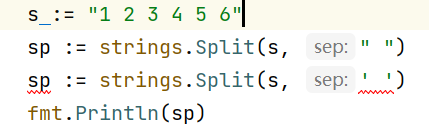

<!-- MDTOC maxdepth:6 firsth1:1 numbering:0 flatten:0 bullets:1 updateOnSave:1 -->

- [strings](#strings)   
   - [func Contains(s, substr string) bool](#func-containss-substr-string-bool)   
   - [func ContainsAny(s, chars string) bool](#func-containsanys-chars-string-bool)   
   - [func HasPrefix(s, prefix string) bool](#func-hasprefixs-prefix-string-bool)   
   - [func HasSuffix(s, suffix string) bool](#func-hassuffixs-suffix-string-bool)   
   - [func Split(s, sep string) []string](#func-splits-sep-string-string)   

<!-- /MDTOC -->
# strings

## func Contains(s, substr string) bool

s字符串中是否包含substr字符串，返回布尔值

1. substr若为字面量，规范用""，若是一个字符也""，别杠

```
fmt.Println(strings.Contains(s2, 's'))
// fmt.Println(strings.Contains(s2, 's'))
fmt.Println(strings.Contains(s2, ""))
// true   任何字符串都包含空串
```

## func ContainsAny(s, chars string) bool

s字符串中是否包含chars字符串中任意一个字符串

```
fmt.Println(strings.ContainsAny(s2, ""))
// false   空串默认排除在外
```


## func HasPrefix(s, prefix string) bool

判断s是否有前缀字符串prefix


## func HasSuffix(s, suffix string) bool

判断s是否有后缀字符串suffix


## func Split(s, sep string) []string

* sep 不可用单引号，若是字面量必须用双引号
* 返回的是字符串切片

```
s := "1 2 3 4 5 6"
sp := strings.Split(s, " ")
//sp := strings.Split(s, ' ')
fmt.Printf("%T - %v", sp, sp)
// []string - [1 2 3 4 5 6]
```




---
