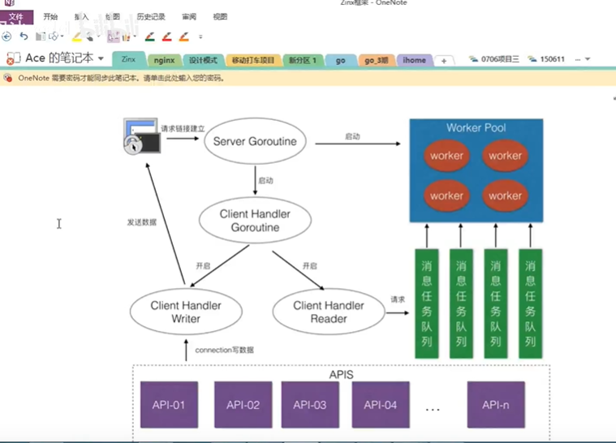
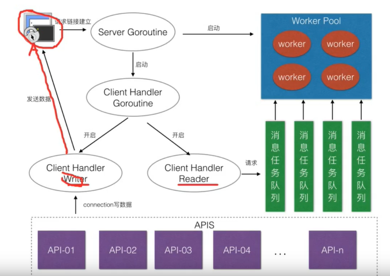
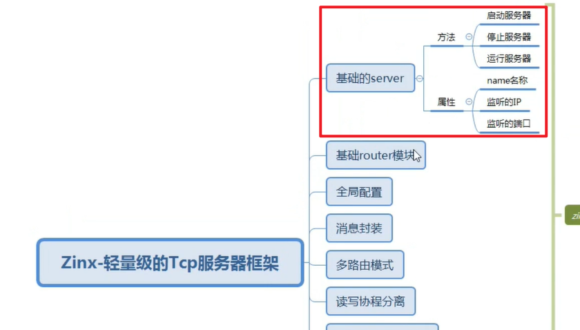

# zinxV0.1-基础server模块定义

整体框架



结构如上图，客户端发送请求，server goroutine监听，如有请求启动client handler



包括一个server，包括读写模块，工作池，消息任务队列


## 基础server模块



```
package ziface

//定义一个服务器接口
type IServer interface {
	//启动服务器方法
	Start()
	//停止服务器方法
	Stop()
	//启动服务
	Serve()
}
```

```
package znet

import (
	"fmt"
	"net"
	"zinx/ziface"
)

//iServer的接口实现，定义一个Server的服务模块
type Server struct {
	//服务器名称
	Name string
	//服务器绑定的ip版本
	IPVersion string
	//服务器监听的IP
	IP string
	//服务器监听的端口
	Port int
}

//启动服务器
func (s *Server) Start() {
	fmt.Printf("[Start] Server Listenner at IP:%s, Port %d is starting", s.IP, s.Port)
	go func() {
		// 1. 获取一个TCP的Addr
		addr, err := net.ResolveTCPAddr(s.IPVersion, fmt.Sprintf("%s:%d", s.IP, s.Port))
		if err != nil {
			fmt.Println("resolve tcp addr error! ", err)
			return
		}
		// 2. 监听服务器地址
		listenner, err := net.ListenTCP(s.IPVersion, addr)
		if err != nil {
			fmt.Println("listen ", s.IPVersion, "err", err)
			return
		}
		fmt.Println("start Zinx server success", s.Name, "Listenning...")
		// 3. 阻塞的等待客户端连接，处理客户端连接业务（读写）
		for {
			// 如果有客户端连接过来，阻塞会返回
			conn, err := listenner.AcceptTCP()
			if err != nil {
				fmt.Println("Accept err", err)
				continue
			}
			// 已经与客户端建立连接，做一些业务，做一个最基本的512字节长度的回显业务
			go func() {
				for {
					buf := make([]byte, 512)
					cnt, err := conn.Read(buf)
					if err != nil {
						fmt.Println("recv buf err", err)
						continue
					}
					fmt.Printf("recv client buf %s,cnt %d\n", string(buf[:cnt]),cnt)
					// 回显功能
					if _, err := conn.Write(buf[:cnt]); err != nil {
						fmt.Println("write back buf err", err)
						continue
					}

				}
			}()
		}
	}()
}

//停止服务器
func (s *Server) Stop() {
	// TODO 将一些服务器资源，状态或者已经开辟的连接信息，进行停止或者回收

}

//运行服务
func (s *Server) Serve() {
	// 启动server服务功能
	s.Start()
	// 做一些启动服务器之后额外的业务

	// 调用Start之后进入阻塞状态，否则程序会直接退出
	select {}
}

/*
	初始化Server模块的方法
*/
func NewServer(name string) ziface.IServer {
	s := &Server{
		Name:      name,
		IPVersion: "tcp4",
		IP:        "0.0.0.0",
		Port:      8888,
	}
	return s
}

```


---
