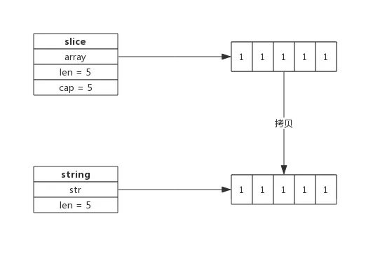
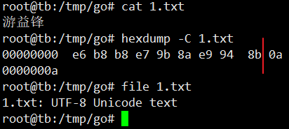

<!-- MDTOC maxdepth:6 firsth1:1 numbering:0 flatten:0 bullets:1 updateOnSave:1 -->

- [string](#string)   
   - [string底层定义](#string底层定义)   
   - [[]byte转string](#byte转string)   
      - [[]byte转换成string一定会拷贝内存吗？ 不一定](#byte转换成string一定会拷贝内存吗？-不一定)   
   - [string转[]byte](#string转byte)   
   - [字符串拼接](#字符串拼接)   
   - [为什么字符串不允许修改？](#为什么字符串不允许修改？)   
   - [string和[]byte如何取舍](#string和byte如何取舍)   
      - [string 使用场景：](#string-使用场景：)   
      - [[]byte 的场景](#byte-的场景)   
   - [参考/摘抄自](#参考摘抄自)   

<!-- /MDTOC -->
# string


```
// string is the set of all strings of 8-bit bytes, conventionally but not
// necessarily representing UTF-8-encoded text. A string may be empty, but
// not nil. Values of string type are immutable.
type string string
```

* string可以为空（长度为0），但不会是nil
* string对象不可以修改
* string是基本数据类型，对string的操作封装成了库叫strings，务必要区分


## string底层定义

src/runtime/string.go:stringStruct 定义了string的数据结构：

```
type stringStruct struct {
	str unsafe.Pointer
	len int
}
```

其数据结构很简单，务必记住：

* stringStruct.str：字符串的首地址，指针
* stringStruct.len：字符串的长度

string数据结构跟切片有些类似，只不过切片还有一个表示容量的成员，事实上string和切片，准确的说是byte切片经常发生转换。


## []byte转string

byte切片可以很方便的转换成string，如下所示：

```
func GetStringBySlice(s []byte) string {
    return string(s)
}
```

需要注意的是这种转换需要一次内存拷贝。转换过程如下：



* 跟据切片的长度申请内存空间，假设内存地址为p，切片长度为len(b)；
* 构建string（string.str = p；string.len = len；）
* 拷贝数据(切片中数据拷贝到新申请的内存空间)


### []byte转换成string一定会拷贝内存吗？ 不一定

byte切片转换成string的场景很多，为了性能上的考虑，
有时候只是临时需要字符串的场景下，byte切片转换成string时并不会拷贝内存，
而是直接返回一个string，这个string的指针(string.str)指向切片的内存。

比如，编译器会识别如下临时场景：

* 使用m[string(b)]来查找map（map是string为key，临时把切片b转成string）；
* 字符串拼接，如"<" + "string(b)" + ">"；
* 字符串比较：string(b) == "foo"

上述，均未赋值给命名变量的情况

因为是临时把byte切片转换成string，也就避免了因byte切片同容改成而导致string引用失败的情况，
所以此时可以不必拷贝内存新建一个string。


## string转[]byte


string也可以方便的转成byte切片，如下所示：

```
func GetSliceByString(str string) []byte {
    return []byte(str)
}
```

string转换成byte切片，也需要一次内存拷贝，其过程如下：


* 先申请切片内存空间
* 再将string拷贝到切片


字符串和[]byte关系：

```
	str := "游益锋a上"
	fmt.Printf("%#v == %s\n", []byte(str), str)
	// []byte{0xe6, 0xb8, 0xb8, 0xe7, 0x9b, 0x8a, 0xe9, 0x94, 0x8b} == 游益锋
	fmt.Printf("%#v == %s\n", []byte(str[0:3]), string(str[0:3])) // 长度为3
	// []byte{0xe6, 0xb8, 0xb8} == 游
	fmt.Printf("%#v == %s\n", []byte(str[3:6]), string(str[3:6])) // 长度为3
	// []byte{0xe7, 0x9b, 0x8a} == 益
	fmt.Printf("%#v == %s\n", []byte(str[6:9]), string(str[6:9])) // 长度为3
	//	[]byte{0xe9, 0x94, 0x8b} == 锋
	fmt.Printf("%#v == %s\n", []byte(str[9:10]), string(str[9:10])) // 长度为1
	//	[]byte{0x61} == a
	fmt.Printf("%#v == %s\n", []byte(str[10:13]), string(str[10:13])) // 长度为3
	//	[]byte{0xe4, 0xb8, 0x8a} == 上
  b1 := []byte{0xe6, 0xb8, 0xb8}
	fmt.Printf("%v -- %X -- %s", b1, b1, b1)
	//[230 184 184] 游
```



从上述测试可知：

1. go默认为UTF-8，属于Unicode，采用了变长存储，有些1，有些3
2. 其实与字符在底层存储是保持一致，但是byte始终是8位来读，而str是基于utf8来解析


## 字符串拼接


字符串可以很方便的拼接，像下面这样：
```
str := "Str1" + "Str2" + "Str3"
```


即便有非常多的字符串需要拼接，性能上也有比较好的保证，
因为新字符串的内存空间是一次分配完成的，所以性能消耗主要在拷贝数据上。

一个拼接语句的字符串编译时都会被存放到一个切片中，
**拼接过程需要遍历两次切片，第一次遍历获取总的字符串长度，据此申请内存，第二次遍历会把字符串逐个拷贝过去。**

字符串拼接伪代码如下：

```
func concatstrings(a []string) string { // 字符串拼接
    length := 0        // 拼接后总的字符串长度

    for _, str := range a {
        length += length(str)
    }

    s, b := rawstring(length) // 生成指定大小的字符串，返回一个string和切片，二者共享内存空间

    for _, str := range a {
        copy(b, str)    // string无法修改，只能通过切片修改
        b = b[len(str):]
    }

    return s
}
```

因为string是无法直接修改的，所以这里使用rawstring()方法初始化一个指定大小的string，同时返回一个切片，二者共享同一块内存空间，后面向切片中拷贝数据，也就间接修改了string。

rawstring()源代码如下：

func rawstring(size int) (s string, b []byte) { // 生成一个新的string，返回的string和切片共享相同的空间
	p := mallocgc(uintptr(size), nil, false)

	stringStructOf(&s).str = p
	stringStructOf(&s).len = size

	*(*slice)(unsafe.Pointer(&b)) = slice{p, size, size}

	return
}


## 为什么字符串不允许修改？

1. string底层是个结构体，包含指针和长度变量
2. 指针指向内存只读段的字符串字面量，因为这个字符串字面量放在了只读段，这就特么只能读了
3. 它本身是struct，支持[X]访问（下标访问），但是只读不可修改

像C++语言中的string，其本身拥有内存空间，修改string是支持的。

但**Go的实现中，string不包含内存空间，只有一个内存的指针**，

这样做的好处是string变得非常轻量，可以很方便的进行传递而不用担心内存拷贝。

因为**string通常指向字符串字面量，而字符串字面量存储位置是只读段，而不是堆或栈上，所以才有了string不可修改的约定**。


## string和[]byte如何取舍

string和[]byte都可以表示字符串，但因数据结构不同，其衍生出来的方法也不同，要根据实际应用场景来选择。


### string 使用场景：

* 需要字符串比较的场景
* 不需要nil的场景。string初始化非nil，且不能直接或间接赋值为nil，不能与nil进行比较

```
fmt.Printf(s2 == nil)
// invalid operation: s2 == nil (mismatched types string and nil)
```


### []byte 的场景

* 所有要修改字符串的场景， 尤其是修改粒度为1个字节
* 函数返回值，需要用nil表示的场景
* 需要切片操作的场景

虽然看起来string适用的场景不如[]byte多，但因为string直观，

在实际应用中还是大量存在，在偏底层的实现中[]byte使用更多。


## 参考/摘抄自

* <http://www.topgoer.cn/docs/gozhuanjia/gozhuanjiastring>


---
